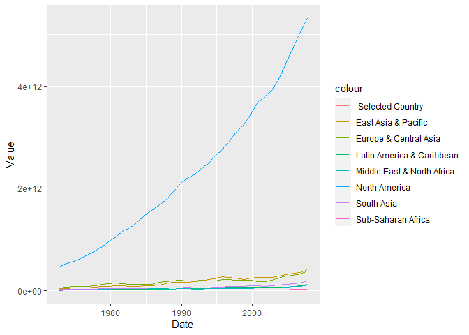
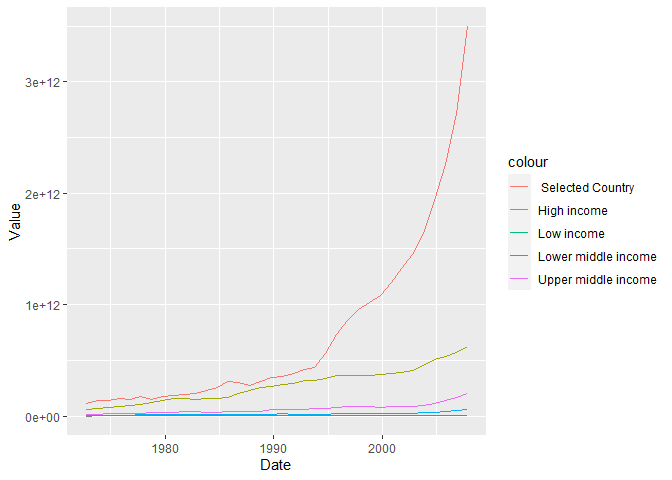

# Navigation {.tabset .tabset-fade .tabset-pills}
## 1. Introduction


### 1.1 Aim of the Group Project from U3-Programming-Advanced R-Msc AI and BA - TBS
- The aim of the project is to make an interactive graphical presentation of data using Shiny App.
- The user should be able to select parameters themselves. The data must be non-trivial, requiring the use of data from several sources or from several different tables.
- Work in groups. circa Three students per group. You can self-select groups.
- There should be need for computations on the data to achive the final results.


### 1.2 Presentaiton of the project choosen and Data
The goal of our project is to build a shiny App to monitor Millennium Developement Goals Progress over time. 

In the year 2000, the member states of the United Nations agreed to a set of goals to measure the progress of global development. The aim of these goals was to increase standards of living around the world by emphasizing human capital, infrastructure, and human rights.     

The eight goals are:

    To eradicate extreme poverty and hunger
    To achieve universal primary education
    To promote gender equality and empower women
    To reduce child mortality
    To improve maternal health
    To combat HIV/AIDS, malaria, and other diseases
    To ensure environmental sustainability
    To develop a global partnership for development


Data on Millennium Development Goals (MDG) indicator trends for developing countries and for different groups of countries are curated in the World Development Indicators database. Each year the World Bank uses these data to assess the progress made towards the MDGs.    

In order to have an aggreted data, we have used a very rich database provided by **Driven Data** offering an open challenge until 2021 with data compiled from the http://www.worldbank.org/ website. The description below of the MDG below comes from their plateforme. 

Driven Data aggregated  data from 1972-2007 on over 1200 macroeconomic indicators in 214 countries around the world. Each row represents a timeseries for a specific indicator and country. The row has an id, a country name, a series code, a series name, and data for the years 1972 - 2007.   


We hope that this presentation allowed to understand our project and the real usefulness of a shiny app! 
Indeed, building interactive dashboards offers the possibility to explore the evolution trend for each country and/or region of the world, to compare them both for each macroeconomic indicator but also for each millennium goal.   

### 1.3 Examples found of target data visualization for our project
http://datatopics.worldbank.org/mdgs/trends-and-projections-of-each-mdg-indicator-for-each-country.html

http://datatopics.worldbank.org/sdgs/


### Example of outline

    Create two Plots: one with death per capita, one with death in absolute numbers. Hint: From coronaD, create a new data table with death per capita instead of death.

    In the original data table coronaD, downloaded from GitHub, add one row with EU27 (the countries in the table that is also a country in the European Union)

    For extra credits: Add annotations to your plot, e.g. the start of the national lock-downs.
    Collect user input:
        Let the user decide between logarithmic and linear scale on the y-axis
        Let the user decide which countries to highlight
        Let the user decide which time frame
    Use a nice theme for the plots, preferably construct the theme yourself with + theme()

    For extra credits: Use a nice theme and layout for the website


## 2. Starting the project

### 2.0 Loading library  

```r
library(shiny)
library(magrittr)
library(data.table)
library(ggplot2)
library(readr)
library(httr)
library(readxl)
library(stringr)
library(XML)
library("methods")
library(dplyr)
```

```
## 
## Attaching package: 'dplyr'
```

```
## The following objects are masked from 'package:data.table':
## 
##     between, first, last
```

```
## The following objects are masked from 'package:stats':
## 
##     filter, lag
```

```
## The following objects are masked from 'package:base':
## 
##     intersect, setdiff, setequal, union
```


### 2.1 Loading Files

```r
urlfile="https://drive.google.com/uc?export=download&id=1mbWQtW83faGtfnwnjlopJblGavaCm7_T"
```

We have registerred into the plateform to acces to the databse and updated the csv file in google Drive


```r
goalD<-urlfile%>% url %>% read_csv %>% as.data.table 
```

```
## Warning: Missing column names filled in: 'X1' [1]
```

```
## Parsed with column specification:
## cols(
##   .default = col_double(),
##   `Country Name` = col_character(),
##   `Series Code` = col_character(),
##   `Series Name` = col_character()
## )
```

```
## See spec(...) for full column specifications.
```


```r
goalD %>% head()
```

```
##    X1 1972 [YR1972] 1973 [YR1973] 1974 [YR1974] 1975 [YR1975] 1976 [YR1976]
## 1:  0            NA            NA            NA            NA            NA
## 2:  1            NA            NA            NA            NA            NA
## 3:  2            NA            NA            NA            NA            NA
## 4:  4            NA            NA            NA            NA            NA
## 5:  5            NA            NA            NA            NA            NA
## 6:  6            NA            NA            NA            NA            NA
##    1977 [YR1977] 1978 [YR1978] 1979 [YR1979] 1980 [YR1980] 1981 [YR1981]
## 1:            NA            NA            NA            NA            NA
## 2:            NA            NA            NA            NA            NA
## 3:            NA            NA            NA            NA            NA
## 4:            NA            NA            NA            NA            NA
## 5:            NA            NA            NA            NA            NA
## 6:            NA            NA            NA            NA            NA
##    1982 [YR1982] 1983 [YR1983] 1984 [YR1984] 1985 [YR1985] 1986 [YR1986]
## 1:            NA            NA            NA            NA            NA
## 2:            NA            NA            NA            NA            NA
## 3:            NA            NA            NA            NA            NA
## 4:            NA            NA            NA            NA            NA
## 5:            NA            NA            NA            NA            NA
## 6:            NA            NA            NA            NA            NA
##    1987 [YR1987] 1988 [YR1988] 1989 [YR1989] 1990 [YR1990] 1991 [YR1991]
## 1:            NA            NA            NA            NA            NA
## 2:            NA            NA            NA            NA            NA
## 3:            NA            NA            NA            NA            NA
## 4:            NA            NA            NA            NA            NA
## 5:            NA            NA            NA            NA            NA
## 6:            NA            NA            NA            NA            NA
##    1992 [YR1992] 1993 [YR1993] 1994 [YR1994] 1995 [YR1995] 1996 [YR1996]
## 1:            NA            NA            NA            NA            NA
## 2:            NA            NA            NA            NA            NA
## 3:            NA            NA            NA            NA            NA
## 4:            NA            NA            NA            NA            NA
## 5:            NA            NA            NA            NA            NA
## 6:            NA            NA            NA            NA            NA
##    1997 [YR1997] 1998 [YR1998] 1999 [YR1999] 2000 [YR2000] 2001 [YR2001]
## 1:            NA            NA            NA            NA            NA
## 2:            NA            NA            NA            NA            NA
## 3:            NA            NA            NA            NA            NA
## 4:            NA            NA            NA            NA            NA
## 5:            NA            NA            NA            NA            NA
## 6:            NA            NA            NA            NA            NA
##    2002 [YR2002] 2003 [YR2003] 2004 [YR2004] 2005 [YR2005] 2006 [YR2006]
## 1:            NA            NA            NA            NA            NA
## 2:            NA            NA            NA            NA            NA
## 3:            NA            NA            NA            NA            NA
## 4:            NA            NA            NA            NA            NA
## 5:            NA            NA            NA            NA            NA
## 6:            NA            NA            NA            NA            NA
##    2007 [YR2007] Country Name   Series Code
## 1:      3.769214  Afghanistan   allsi.bi_q1
## 2:      7.027746  Afghanistan   allsp.bi_q1
## 3:      8.244887  Afghanistan   allsa.bi_q1
## 4:     12.933105  Afghanistan allsi.gen_pop
## 5:     18.996814  Afghanistan allsp.gen_pop
## 6:     22.423064  Afghanistan allsa.gen_pop
##                                                         Series Name
## 1:   (%) Benefits held by 1st 20% population - All Social Insurance
## 2:  (%) Benefits held by 1st 20% population - All Social Protection
## 3: (%) Benefits held by 1st 20% population - All Social Safety Nets
## 4:                           (%) Generosity of All Social Insurance
## 5:                          (%) Generosity of All Social Protection
## 6:                         (%) Generosity of All Social Safety Nets
```

```r
str(goalD)
```

```
## Classes 'data.table' and 'data.frame':	195402 obs. of  40 variables:
##  $ X1           : num  0 1 2 4 5 6 8 9 10 11 ...
##  $ 1972 [YR1972]: num  NA NA NA NA NA NA NA NA NA NA ...
##  $ 1973 [YR1973]: num  NA NA NA NA NA NA NA NA NA NA ...
##  $ 1974 [YR1974]: num  NA NA NA NA NA NA NA NA NA NA ...
##  $ 1975 [YR1975]: num  NA NA NA NA NA NA NA NA NA NA ...
##  $ 1976 [YR1976]: num  NA NA NA NA NA NA NA NA NA NA ...
##  $ 1977 [YR1977]: num  NA NA NA NA NA NA NA NA NA NA ...
##  $ 1978 [YR1978]: num  NA NA NA NA NA NA NA NA NA NA ...
##  $ 1979 [YR1979]: num  NA NA NA NA NA NA NA NA NA NA ...
##  $ 1980 [YR1980]: num  NA NA NA NA NA NA NA NA NA NA ...
##  $ 1981 [YR1981]: num  NA NA NA NA NA NA NA NA NA NA ...
##  $ 1982 [YR1982]: num  NA NA NA NA NA NA NA NA NA NA ...
##  $ 1983 [YR1983]: num  NA NA NA NA NA NA NA NA NA NA ...
##  $ 1984 [YR1984]: num  NA NA NA NA NA NA NA NA NA NA ...
##  $ 1985 [YR1985]: num  NA NA NA NA NA NA NA NA NA NA ...
##  $ 1986 [YR1986]: num  NA NA NA NA NA NA NA NA NA NA ...
##  $ 1987 [YR1987]: num  NA NA NA NA NA NA NA NA NA NA ...
##  $ 1988 [YR1988]: num  NA NA NA NA NA NA NA NA NA NA ...
##  $ 1989 [YR1989]: num  NA NA NA NA NA NA NA NA NA NA ...
##  $ 1990 [YR1990]: num  NA NA NA NA NA NA NA NA NA NA ...
##  $ 1991 [YR1991]: num  NA NA NA NA NA NA NA NA NA NA ...
##  $ 1992 [YR1992]: num  NA NA NA NA NA NA NA NA NA NA ...
##  $ 1993 [YR1993]: num  NA NA NA NA NA NA NA NA NA NA ...
##  $ 1994 [YR1994]: num  NA NA NA NA NA NA NA NA NA NA ...
##  $ 1995 [YR1995]: num  NA NA NA NA NA NA NA NA NA NA ...
##  $ 1996 [YR1996]: num  NA NA NA NA NA NA NA NA NA NA ...
##  $ 1997 [YR1997]: num  NA NA NA NA NA NA NA NA NA NA ...
##  $ 1998 [YR1998]: num  NA NA NA NA NA NA NA NA NA NA ...
##  $ 1999 [YR1999]: num  NA NA NA NA NA NA NA NA NA NA ...
##  $ 2000 [YR2000]: num  NA NA NA NA NA NA NA NA NA NA ...
##  $ 2001 [YR2001]: num  NA NA NA NA NA NA NA NA NA NA ...
##  $ 2002 [YR2002]: num  NA NA NA NA NA NA NA NA NA NA ...
##  $ 2003 [YR2003]: num  NA NA NA NA NA NA NA NA NA NA ...
##  $ 2004 [YR2004]: num  NA NA NA NA NA NA NA NA NA NA ...
##  $ 2005 [YR2005]: num  NA NA NA NA NA NA NA NA NA NA ...
##  $ 2006 [YR2006]: num  NA NA NA NA NA NA NA NA NA NA ...
##  $ 2007 [YR2007]: num  3.77 7.03 8.24 12.93 19 ...
##  $ Country Name : chr  "Afghanistan" "Afghanistan" "Afghanistan" "Afghanistan" ...
##  $ Series Code  : chr  "allsi.bi_q1" "allsp.bi_q1" "allsa.bi_q1" "allsi.gen_pop" ...
##  $ Series Name  : chr  "(%) Benefits held by 1st 20% population - All Social Insurance" "(%) Benefits held by 1st 20% population - All Social Protection" "(%) Benefits held by 1st 20% population - All Social Safety Nets" "(%) Generosity of All Social Insurance" ...
##  - attr(*, "spec")=
##   .. cols(
##   ..   X1 = col_double(),
##   ..   `1972 [YR1972]` = col_double(),
##   ..   `1973 [YR1973]` = col_double(),
##   ..   `1974 [YR1974]` = col_double(),
##   ..   `1975 [YR1975]` = col_double(),
##   ..   `1976 [YR1976]` = col_double(),
##   ..   `1977 [YR1977]` = col_double(),
##   ..   `1978 [YR1978]` = col_double(),
##   ..   `1979 [YR1979]` = col_double(),
##   ..   `1980 [YR1980]` = col_double(),
##   ..   `1981 [YR1981]` = col_double(),
##   ..   `1982 [YR1982]` = col_double(),
##   ..   `1983 [YR1983]` = col_double(),
##   ..   `1984 [YR1984]` = col_double(),
##   ..   `1985 [YR1985]` = col_double(),
##   ..   `1986 [YR1986]` = col_double(),
##   ..   `1987 [YR1987]` = col_double(),
##   ..   `1988 [YR1988]` = col_double(),
##   ..   `1989 [YR1989]` = col_double(),
##   ..   `1990 [YR1990]` = col_double(),
##   ..   `1991 [YR1991]` = col_double(),
##   ..   `1992 [YR1992]` = col_double(),
##   ..   `1993 [YR1993]` = col_double(),
##   ..   `1994 [YR1994]` = col_double(),
##   ..   `1995 [YR1995]` = col_double(),
##   ..   `1996 [YR1996]` = col_double(),
##   ..   `1997 [YR1997]` = col_double(),
##   ..   `1998 [YR1998]` = col_double(),
##   ..   `1999 [YR1999]` = col_double(),
##   ..   `2000 [YR2000]` = col_double(),
##   ..   `2001 [YR2001]` = col_double(),
##   ..   `2002 [YR2002]` = col_double(),
##   ..   `2003 [YR2003]` = col_double(),
##   ..   `2004 [YR2004]` = col_double(),
##   ..   `2005 [YR2005]` = col_double(),
##   ..   `2006 [YR2006]` = col_double(),
##   ..   `2007 [YR2007]` = col_double(),
##   ..   `Country Name` = col_character(),
##   ..   `Series Code` = col_character(),
##   ..   `Series Name` = col_character()
##   .. )
##  - attr(*, ".internal.selfref")=<externalptr>
```


```r
goalD[X1==559]
```

```
##     X1 1972 [YR1972] 1973 [YR1973] 1974 [YR1974] 1975 [YR1975] 1976 [YR1976]
## 1: 559            NA            NA            NA            NA            NA
##    1977 [YR1977] 1978 [YR1978] 1979 [YR1979] 1980 [YR1980] 1981 [YR1981]
## 1:            NA            NA            NA            NA            NA
##    1982 [YR1982] 1983 [YR1983] 1984 [YR1984] 1985 [YR1985] 1986 [YR1986]
## 1:            NA            NA            NA            NA            NA
##    1987 [YR1987] 1988 [YR1988] 1989 [YR1989] 1990 [YR1990] 1991 [YR1991]
## 1:            NA            NA            NA            NA         0.048
##    1992 [YR1992] 1993 [YR1993] 1994 [YR1994] 1995 [YR1995] 1996 [YR1996]
## 1:         0.049         0.049         0.049         0.049         0.084
##    1997 [YR1997] 1998 [YR1998] 1999 [YR1999] 2000 [YR2000] 2001 [YR2001]
## 1:         0.118         0.152         0.187         0.221         0.256
##    2002 [YR2002] 2003 [YR2003] 2004 [YR2004] 2005 [YR2005] 2006 [YR2006]
## 1:         0.291         0.325          0.36         0.395          0.43
##    2007 [YR2007] Country Name Series Code                         Series Name
## 1:         0.465  Afghanistan         7.8 Ensure environmental sustainability
```
So here we can see that ID=559 corresponds to Afganistant 7.8 indicators for environetanl sustainibilty goal (Goal7) According to MG website, 7.8 is defined by the Proportion of population using an improved drinking water source. 


Using colnames() in order to extract all the column names that are Dates and save these as the character vector Dates. 
Dates are from the 2dn column to the 37th
But first, we should rename these columns by removing "YR+Date" and add a _ in the other columns


```r
cols<-c("Index","1972","1973","1974","1975","1976","1977","1978","1979","1980","1981","1982","1983","1984","1985","1986","1987","1988","1989","1990","1991","1992","1993","1994","1995","1996","1997","1998","1999","2000","2001","2002","2003","2004","2005","2006","2007","Country_Name","Series_Code","Series_Name")
colnames(goalD)<-cols
head(goalD)
```

```
##    Index 1972 1973 1974 1975 1976 1977 1978 1979 1980 1981 1982 1983 1984 1985
## 1:     0   NA   NA   NA   NA   NA   NA   NA   NA   NA   NA   NA   NA   NA   NA
## 2:     1   NA   NA   NA   NA   NA   NA   NA   NA   NA   NA   NA   NA   NA   NA
## 3:     2   NA   NA   NA   NA   NA   NA   NA   NA   NA   NA   NA   NA   NA   NA
## 4:     4   NA   NA   NA   NA   NA   NA   NA   NA   NA   NA   NA   NA   NA   NA
## 5:     5   NA   NA   NA   NA   NA   NA   NA   NA   NA   NA   NA   NA   NA   NA
## 6:     6   NA   NA   NA   NA   NA   NA   NA   NA   NA   NA   NA   NA   NA   NA
##    1986 1987 1988 1989 1990 1991 1992 1993 1994 1995 1996 1997 1998 1999 2000
## 1:   NA   NA   NA   NA   NA   NA   NA   NA   NA   NA   NA   NA   NA   NA   NA
## 2:   NA   NA   NA   NA   NA   NA   NA   NA   NA   NA   NA   NA   NA   NA   NA
## 3:   NA   NA   NA   NA   NA   NA   NA   NA   NA   NA   NA   NA   NA   NA   NA
## 4:   NA   NA   NA   NA   NA   NA   NA   NA   NA   NA   NA   NA   NA   NA   NA
## 5:   NA   NA   NA   NA   NA   NA   NA   NA   NA   NA   NA   NA   NA   NA   NA
## 6:   NA   NA   NA   NA   NA   NA   NA   NA   NA   NA   NA   NA   NA   NA   NA
##    2001 2002 2003 2004 2005 2006      2007 Country_Name   Series_Code
## 1:   NA   NA   NA   NA   NA   NA  3.769214  Afghanistan   allsi.bi_q1
## 2:   NA   NA   NA   NA   NA   NA  7.027746  Afghanistan   allsp.bi_q1
## 3:   NA   NA   NA   NA   NA   NA  8.244887  Afghanistan   allsa.bi_q1
## 4:   NA   NA   NA   NA   NA   NA 12.933105  Afghanistan allsi.gen_pop
## 5:   NA   NA   NA   NA   NA   NA 18.996814  Afghanistan allsp.gen_pop
## 6:   NA   NA   NA   NA   NA   NA 22.423064  Afghanistan allsa.gen_pop
##                                                         Series_Name
## 1:   (%) Benefits held by 1st 20% population - All Social Insurance
## 2:  (%) Benefits held by 1st 20% population - All Social Protection
## 3: (%) Benefits held by 1st 20% population - All Social Safety Nets
## 4:                           (%) Generosity of All Social Insurance
## 5:                          (%) Generosity of All Social Protection
## 6:                         (%) Generosity of All Social Safety Nets
```


```r
Dates = (colnames(goalD[,!(c(1,38,39,40))]))
```


### 2.2 Building up Goals - Topics and Sub-Topics
Count unique macroindicator by Series Name and Series Code


```r
goalD[,.N,(goalD$Series_Name)]
```

```
##                                                                                         goalD
##    1:                          (%) Benefits held by 1st 20% population - All Social Insurance
##    2:                         (%) Benefits held by 1st 20% population - All Social Protection
##    3:                        (%) Benefits held by 1st 20% population - All Social Safety Nets
##    4:                                                  (%) Generosity of All Social Insurance
##    5:                                                 (%) Generosity of All Social Protection
##   ---                                                                                        
## 1301:                       (%) Benefits held by 1st 20% population - Unemp benefits and ALMP
## 1302:                                               (%) Generosity of Unemp benefits and ALMP
## 1303:                                Net official flows from UN agencies, UNPBF (current US$)
## 1304:                                Net official flows from UN agencies, UNRWA (current US$)
## 1305: Presence of peace keepers (number of troops, police, and military observers in mandate)
##        N
##    1: 33
##    2: 36
##    3: 32
##    4: 33
##    5: 36
##   ---   
## 1301:  8
## 1302:  8
## 1303:  3
## 1304:  4
## 1305:  1
```

```r
goalD[,.N,(goalD$Series_Code)]
```

```
##                goalD  N
##    1:    allsi.bi_q1 33
##    2:    allsp.bi_q1 36
##    3:    allsa.bi_q1 32
##    4:  allsi.gen_pop 33
##    5:  allsp.gen_pop 36
##   ---                  
## 1301:    lm_ub.bi_q1  8
## 1302:  lm_ub.gen_pop  8
## 1303: DT.NFL.UNPB.CD  3
## 1304: DT.NFL.UNRW.CD  4
## 1305: VC.PKP.TOTL.UN  1
```
There are 1305 unique Series Name and Series Code

Class what are the most frequent macroindicators

```r
goalD[,.N,by = list(Series_Code,Series_Name)] %>% .[order(-N)]
```

```
##          Series_Code
##    1: NY.ADJ.DNGY.CD
##    2: NY.ADJ.DMIN.CD
##    3:    SP.POP.TOTL
##    4:    SP.POP.GROW
##    5: AG.LND.TOTL.K2
##   ---               
## 1301:  lm_ub.gen_pop
## 1302: DT.NFL.UNRW.CD
## 1303: DT.NFL.UNPB.CD
## 1304: IC.FRM.FEMM.ZS
## 1305: VC.PKP.TOTL.UN
##                                                                                   Series_Name
##    1:                                        Adjusted savings: energy depletion (current US$)
##    2:                                       Adjusted savings: mineral depletion (current US$)
##    3:                                                                      Population (Total)
##    4:                                                            Population growth (annual %)
##    5:                                                                      Land area (sq. km)
##   ---                                                                                        
## 1301:                                               (%) Generosity of Unemp benefits and ALMP
## 1302:                                Net official flows from UN agencies, UNRWA (current US$)
## 1303:                                Net official flows from UN agencies, UNPBF (current US$)
## 1304:                                              Firms with female top manager (% of firms)
## 1305: Presence of peace keepers (number of troops, police, and military observers in mandate)
##         N
##    1: 214
##    2: 214
##    3: 214
##    4: 214
##    5: 213
##   ---    
## 1301:   8
## 1302:   4
## 1303:   3
## 1304:   2
## 1305:   1
```


Get metric in indicators Names : 
Using stringr library and str_extract_all in order to get in a matrix all what is inside parenthesis


```r
# Get the parenthesis and what is inside
metrics <- as.data.frame(str_extract_all(goalD$Series_Name, "\\([^()]+\\)", simplify = TRUE))
```

Some metrics had double parenthesis and thus created a second column in our matrix

```r
unique(metrics[,2])
```

```
##  [1] ""                        "(per 100,000 adults)"   
##  [3] "(NFL, current US$)"      "(TDS, current US$)"     
##  [5] "(DIS, current US$)"      "(modeled ILO estimate)" 
##  [7] "(DOD, current US$)"      "(INT, current US$)"     
##  [9] "(current US$)"           "(current LCU)"          
## [11] "(NTR, current US$)"      "(kg per day per worker)"
## [13] "(kg per day)"            "(AMT, current US$)"     
## [15] "(national estimate)"     "(constant 2011 PPP)"    
## [17] "(%)"                     "(% of population)"
```

We should merge them into the first column. So we copy content of second colomun into first if second is not null. 


```r
metrics$V1 <- apply(metrics, 1, function(x) paste(str_trim(x[!is.na(x)]), collapse=""))
```


```r
metrics %>% head
```

```
##    V1 V2
## 1 (%)   
## 2 (%)   
## 3 (%)   
## 4 (%)   
## 5 (%)   
## 6 (%)
```


```r
#Verify results
metrics$V1[10000]
```

```
## [1] "(annual % growth)"
```

```r
goalD[10000]
```

```
##    Index 1972 1973 1974 1975 1976 1977 1978 1979 1980 1981 1982 1983 1984 1985
## 1: 16108   NA   NA   NA   NA   NA   NA   NA   NA   NA   NA   NA   NA   NA   NA
##    1986 1987 1988 1989 1990 1991 1992  1993  1994      1995     1996      1997
## 1:   NA   NA   NA   NA   NA   NA   NA -16.3 -12.8 -7.000003 2.999996 -6.899994
##        1998     1999     2000 2001 2002 2003 2004 2005 2006 2007 Country_Name
## 1: 6.199991 7.100007 19.58732 11.1  6.4  5.6    5  7.5  0.9    4   Azerbaijan
##          Series_Code                                Series_Name
## 1: NV.AGR.TOTL.KD.ZG Agriculture, value added (annual % growth)
```
We can then add new column to goalD. 


```r
goalD$Metrics<-metrics$V1
goalD %>% head
```

```
##    Index 1972 1973 1974 1975 1976 1977 1978 1979 1980 1981 1982 1983 1984 1985
## 1:     0   NA   NA   NA   NA   NA   NA   NA   NA   NA   NA   NA   NA   NA   NA
## 2:     1   NA   NA   NA   NA   NA   NA   NA   NA   NA   NA   NA   NA   NA   NA
## 3:     2   NA   NA   NA   NA   NA   NA   NA   NA   NA   NA   NA   NA   NA   NA
## 4:     4   NA   NA   NA   NA   NA   NA   NA   NA   NA   NA   NA   NA   NA   NA
## 5:     5   NA   NA   NA   NA   NA   NA   NA   NA   NA   NA   NA   NA   NA   NA
## 6:     6   NA   NA   NA   NA   NA   NA   NA   NA   NA   NA   NA   NA   NA   NA
##    1986 1987 1988 1989 1990 1991 1992 1993 1994 1995 1996 1997 1998 1999 2000
## 1:   NA   NA   NA   NA   NA   NA   NA   NA   NA   NA   NA   NA   NA   NA   NA
## 2:   NA   NA   NA   NA   NA   NA   NA   NA   NA   NA   NA   NA   NA   NA   NA
## 3:   NA   NA   NA   NA   NA   NA   NA   NA   NA   NA   NA   NA   NA   NA   NA
## 4:   NA   NA   NA   NA   NA   NA   NA   NA   NA   NA   NA   NA   NA   NA   NA
## 5:   NA   NA   NA   NA   NA   NA   NA   NA   NA   NA   NA   NA   NA   NA   NA
## 6:   NA   NA   NA   NA   NA   NA   NA   NA   NA   NA   NA   NA   NA   NA   NA
##    2001 2002 2003 2004 2005 2006      2007 Country_Name   Series_Code
## 1:   NA   NA   NA   NA   NA   NA  3.769214  Afghanistan   allsi.bi_q1
## 2:   NA   NA   NA   NA   NA   NA  7.027746  Afghanistan   allsp.bi_q1
## 3:   NA   NA   NA   NA   NA   NA  8.244887  Afghanistan   allsa.bi_q1
## 4:   NA   NA   NA   NA   NA   NA 12.933105  Afghanistan allsi.gen_pop
## 5:   NA   NA   NA   NA   NA   NA 18.996814  Afghanistan allsp.gen_pop
## 6:   NA   NA   NA   NA   NA   NA 22.423064  Afghanistan allsa.gen_pop
##                                                         Series_Name Metrics
## 1:   (%) Benefits held by 1st 20% population - All Social Insurance     (%)
## 2:  (%) Benefits held by 1st 20% population - All Social Protection     (%)
## 3: (%) Benefits held by 1st 20% population - All Social Safety Nets     (%)
## 4:                           (%) Generosity of All Social Insurance     (%)
## 5:                          (%) Generosity of All Social Protection     (%)
## 6:                         (%) Generosity of All Social Safety Nets     (%)
```

We need to add new row with the attached Goal for each indicators in order to have a global view of each indicators. 
To do that, we need to add another ressource to our data : mapping from the World Bank. 
https://datahelpdesk.worldbank.org/knowledgebase/articles/201175-how-does-the-world-bank-code-its-indicators

"A systematic coding convention is an important part of database design. Variable codes should be both convenient to use and easy to remember. Codes that are long and descriptive are slow to enter and result in formulas that are difficult to read."
The data help desk from the World Bank provides Word Developeemnt Indicatorcode breakdowns and descriptions for each component. 

Let us load this code.

```r
urlfile_WDI_break="http://databank.worldbank.org/data/download/site-content/WDI_CETS.xls"
```

WDI series code are in the 2dn sheet of the xls file. 
We use Get function since readxl doesn't support http download yet.  

```r
GET(urlfile_WDI_break, write_disk(tf <- tempfile(fileext = ".xls")))
```

```
## Response [https://databank.worldbank.org/data/download/site-content/WDI_CETS.xls]
##   Date: 2020-10-12 21:17
##   Status: 200
##   Content-Type: application/vnd.ms-excel
##   Size: 439 kB
## <ON DISK>  C:\Users\swp\AppData\Local\Temp\RtmpMPuEBH\file278441539a1.xls
```

```r
WDI_break <- read_xls(tf, sheet=2) %>% as.data.table 
head(WDI_break)
```

```
##          Series Code
## 1:    AG.AGR.TRAC.NO
## 2: AG.CON.FERT.PT.ZS
## 3:    AG.CON.FERT.ZS
## 4:    AG.LND.AGRI.K2
## 5:    AG.LND.AGRI.ZS
## 6:    AG.LND.ARBL.HA
##                                                      Series Name       Topic
## 1:                              Agricultural machinery, tractors Environment
## 2:           Fertilizer consumption (% of fertilizer production) Environment
## 3: Fertilizer consumption (kilograms per hectare of arable land) Environment
## 4:                                    Agricultural land (sq. km) Environment
## 5:                            Agricultural land (% of land area) Environment
## 6:                                        Arable land (hectares) Environment
##                  SubTopic1 SubTopic2 SubTopic3
## 1: Agricultural production      <NA>      <NA>
## 2: Agricultural production      <NA>      <NA>
## 3: Agricultural production      <NA>      <NA>
## 4:                Land use      <NA>      <NA>
## 5:                Land use      <NA>      <NA>
## 6:                Land use      <NA>      <NA>
```

```r
WDI_break %>% View
```

Rename Series Code and Series Name with underscore


```r
colnames(WDI_break) =  colnames(WDI_break) %>% gsub(" ","_",.) 
```
Count how many series code there is in WDI_break, topics, sub-topics1, sub-topics2 and sub-topic3 and order them by frequency

```r
WDI_break[,.N,(WDI_break$Series_Code)]%>% .[order(-N)]
```

```
##               WDI_break N
##    1:    AG.AGR.TRAC.NO 1
##    2: AG.CON.FERT.PT.ZS 1
##    3:    AG.CON.FERT.ZS 1
##    4:    AG.LND.AGRI.K2 1
##    5:    AG.LND.AGRI.ZS 1
##   ---                    
## 1500:       WP15163_4.1 1
## 1501:       WP15163_4.2 1
## 1502:       WP15163_4.3 1
## 1503:       WP15163_4.8 1
## 1504:       WP15163_4.9 1
```

```r
WDI_break[,.N,(WDI_break$Topic)]%>% .[order(-N)]
```

```
##                     WDI_break   N
##  1:    Economic Policy & Debt 508
##  2:                    Health 174
##  3:    Private Sector & Trade 164
##  4: Social Protection & Labor 157
##  5:                 Education 151
##  6:               Environment 135
##  7:             Public Sector  82
##  8:          Financial Sector  54
##  9:            Infrastructure  40
## 10:                   Poverty  22
## 11:                    Gender  17
```

```r
WDI_break[,.N,(WDI_break$SubTopic1)]%>% .[order(-N)]
```

```
##                                 WDI_break   N
##  1:                         External debt 211
##  2:                     National accounts 173
##  3:                     Economic activity  75
##  4:       Official development assistance  58
##  5:                  Business environment  53
##  6:                   Balance of payments  51
##  7:                            Population  51
##  8:                                Inputs  46
##  9:                    Government finance  45
## 10:                         Participation  44
## 11:                              Outcomes  40
## 12:                             Emissions  39
## 13:                           Performance  27
## 14:                          Risk factors  27
## 15:               Energy production & use  25
## 16:                 Policy & institutions  25
## 17:                             Nutrition  25
## 18:                 Labor force structure  25
## 19:                              Land use  24
## 20:                          Unemployment  24
## 21:                               Tariffs  24
## 22:                               Imports  23
## 23:                               Exports  23
## 24:                    Trade facilitation  21
## 25:                            Efficiency  21
## 26:                             Mortality  21
## 27:                    Disease prevention  18
## 28:                   Reproductive health  16
## 29:                        Health systems  16
## 30:                                Access  15
## 31:                            Technology  15
## 32:               Purchasing power parity  15
## 33:               Agricultural production  14
## 34:                        Communications  13
## 35:                                Assets  13
## 36:                Density & urbanization  12
## 37:                        Transportation  12
## 38:               Exchange rates & prices  10
## 39:                         Poverty rates  10
## 40:                      Travel & tourism  10
## 41:         Public life & decision making   9
## 42:                            Freshwater   8
## 43:                   Income distribution   8
## 44:                       Capital markets   7
## 45:        Biodiversity & protected areas   7
## 46:                  Defense & arms trade   7
## 47:                                Health   7
## 48: Natural resources contribution to GDP   6
## 49:                             Migration   6
## 50:                        Interest rates   5
## 51:                         Trade indexes   5
## 52:                  Conflict & fragility   5
## 53:       Monetary holdings (liabilities)   4
## 54:     Private infrastructure investment   4
## 55:                     Shared prosperity   4
## 56:                Participation & access   1
## 57:               Total merchandise trade   1
##                                 WDI_break   N
```

```r
WDI_break[,.N,(WDI_break$SubTopic2)]%>% .[order(-N)]
```

```
##                             WDI_break   N
##  1:                              <NA> 973
##  2:                         Structure  39
##  3:                   Current account  33
##  4:  Local currency at current prices  29
##  5: Local currency at constant prices  28
##  6:         Adjusted savings & income  28
##  7:                         Net flows  27
##  8:                  Debt outstanding  25
##  9:             US$ at current prices  25
## 10:             Shares of GDP & other  24
## 11:      Arrears, reschedulings, etc.  22
## 12:                           Revenue  22
## 13:       US$ at constant 2010 prices  20
## 14:                          Interest  19
## 15:                      Amortization  18
## 16:                     Disbursements  18
## 17:                      Debt service  18
## 18:         Debt ratios & other items  17
## 19:                     Net transfers  17
## 20:                      Growth rates  17
## 21:                           Expense  13
## 22:       Capital & financial account  12
## 23:                             Terms  12
## 24:                          Dynamics  12
## 25:              Currency composition  10
## 26:               Deficit & financing  10
## 27:            Reserves & other items   6
## 28:                       Commitments   5
## 29:                  Undisbursed debt   3
## 30:        Atlas GNI & GNI per capita   2
##                             WDI_break   N
```

```r
WDI_break[,.N,(WDI_break$SubTopic3)]%>% .[order(-N)]
```

```
##                   WDI_break    N
## 1:                     <NA> 1369
## 2:       Expenditure on GDP   50
## 3:     Aggregate indicators   33
## 4: Goods, services & income   22
## 5:              Value added   16
## 6:                Transfers    7
## 7:                 Balances    4
## 8:              Other items    3
```

Some Series Code (those in miniscule and numbers are not codded in World Bank Break). We decided to remove them from our dataset By doing an inner join(by setting: allx=FALSE)

```r
goalD_old <-goalD
goalD <- merge(goalD,WDI_break, by.x = 'Series_Code', by.y = 'Series_Code', all = FALSE)
```
Count removed observations

```r
dim(goalD_old)-dim(goalD)
```

```
## [1] 13677    -5
```
We have removed 13 677 observations due to missing informations in our coding tables. 


We can remove 1 dupicated Series_Name from our dataset

```r
goalD<-goalD[,!42]
colnames(goalD[,40])="Series_Name"
```


### 2.3 Contry Classification
Here Country Classifications
https://datahelpdesk.worldbank.org/knowledgebase/articles/906519-world-bank-country-and-lending-groups


Use current classification of World Bank for country

```r
urlfile_Country_break="http://databank.worldbank.org/data/download/site-content/CLASS.xls"
```

Here we use sheet n=1 (for funny fact, the excel file had 1 hidden sheet :)) and select group name

```r
GET(urlfile_Country_break, write_disk(tf <- tempfile(fileext = ".xls")))
```

```
## Response [https://databank.worldbank.org/data/download/site-content/CLASS.xls]
##   Date: 2020-10-12 21:17
##   Status: 200
##   Content-Type: application/vnd.ms-excel
##   Size: 236 kB
## <ON DISK>  C:\Users\swp\AppData\Local\Temp\RtmpMPuEBH\file278430762529.xls
```

```r
Country_break <- read_xls(tf, range="C5:I224", sheet=1) %>% as.data.table 
head(Country_break)
```

```
##           Economy Code    X                     Region        Income group
## 1:              x    x    x                          x                   x
## 2:    Afghanistan  AFG <NA>                 South Asia          Low income
## 3:        Albania  ALB <NA>      Europe & Central Asia Upper middle income
## 4:        Algeria  DZA <NA> Middle East & North Africa Lower middle income
## 5: American Samoa  ASM <NA>        East Asia & Pacific Upper middle income
## 6:        Andorra  AND <NA>      Europe & Central Asia         High income
##    Lending category Other
## 1:                x     x
## 2:              IDA  HIPC
## 3:             IBRD  <NA>
## 4:             IBRD  <NA>
## 5:               ..  <NA>
## 6:               ..  <NA>
```

```r
Country_break %>% View
```
The idea for the final Shiny app is to propose selection of aggregaed Countries following World Bank classification to the user in order to compare indicators in different countries. 


The Column E and the Row 6 from our excel file were empty. We can remove them. 
Furthermore, we can void Code information from our table and remplace space in colname by an inderscore. 


```r
#Extract iso code for later map
Code_break<-Country_break[,c(1,2)] %>% setDT
Country_break<-Country_break[!1,!c(2,3)]
colnames(Country_break) =  colnames(Country_break) %>% gsub(" ","_",.) 
Country_break %>% head
```

```
##           Economy                     Region        Income_group
## 1:    Afghanistan                 South Asia          Low income
## 2:        Albania      Europe & Central Asia Upper middle income
## 3:        Algeria Middle East & North Africa Lower middle income
## 4: American Samoa        East Asia & Pacific Upper middle income
## 5:        Andorra      Europe & Central Asia         High income
## 6:         Angola         Sub-Saharan Africa Lower middle income
##    Lending_category Other
## 1:              IDA  HIPC
## 2:             IBRD  <NA>
## 3:             IBRD  <NA>
## 4:               ..  <NA>
## 5:               ..  <NA>
## 6:             IBRD  <NA>
```


The World Bank provides details about how they classify countries :
https://datahelpdesk.worldbank.org/knowledgebase/articles/378834-how-does-the-world-bank-classify-countries


From their website, we can read that 
"The main classifications provided are by geographic region, by income group, and by the operational lending categories of the World Bank Group.[...]   
Groupings are primarily based on the regions used for administrative purposes by the World Bank. There are two main variants: one which includes all economies, and one which excludes high-income economies (see income groups below for the definition of low-, lower middle-, upper middle-, and high-income categories).    

Income groups
Economies are currently divided into four income groupings: low, lower-middle, upper-middle, and high. Income is measured using gross national income (GNI) per capita, in U.S. dollars, converted from local currency using the World Bank Atlas method.

Economies are divided into IDA, IBRD, and Blend countries based on the operational policies of the World Bank. International Development Association (IDA) countries are those with low per capita incomes that lack the financial ability to borrow from the International Bank for Reconstruction and Development (IBRD). Blend countries are eligible for IDA loans but are also eligible for IBRD loans because they are financially creditworthy. 


Finaly, Other country groupings in World Development Indicators include OECD member countries, countries in the euro area, member states of the European Union, the UN Least Development Countries classification, and the World."

We can now perform an Left Join with merge function

```r
goalD<-merge(goalD,Country_break, by.x = 'Country_Name', by.y = 'Economy', all.x=TRUE)
goalD %>% head
```

```
##    Country_Name       Series_Code Index         1972         1973         1974
## 1:  Afghanistan    AG.AGR.TRAC.NO    54 6.000000e+02 5.850000e+02 5.700000e+02
## 2:  Afghanistan AG.CON.FERT.PT.ZS   382           NA           NA           NA
## 3:  Afghanistan    AG.CON.FERT.ZS   383           NA           NA           NA
## 4:  Afghanistan    AG.LND.AGRI.K2    53 3.804600e+05 3.804800e+05 3.804800e+05
## 5:  Afghanistan    AG.LND.AGRI.ZS    52 5.833218e+01 5.833525e+01 5.833525e+01
## 6:  Afghanistan    AG.LND.ARBL.HA    81 7.910000e+06 7.910000e+06 7.910000e+06
##            1975         1976         1977         1978         1979
## 1: 5.500000e+02 5.300000e+02 5.150000e+02 4.950000e+02 4.500000e+02
## 2:           NA           NA           NA           NA           NA
## 3:           NA           NA           NA           NA           NA
## 4: 3.804800e+05 3.804800e+05 3.805000e+05 3.805000e+05 3.804900e+05
## 5: 5.833525e+01 5.833525e+01 5.833832e+01 5.833832e+01 5.833678e+01
## 6: 7.910000e+06 7.910000e+06 7.910000e+06 7.910000e+06 7.910000e+06
##            1980         1981         1982         1983         1984
## 1: 4.000000e+02 3.500000e+02 3.000000e+02 2.500000e+02 2.000000e+02
## 2:           NA           NA           NA           NA           NA
## 3:           NA           NA           NA           NA           NA
## 4: 3.804900e+05 3.805300e+05 3.805400e+05 3.805400e+05 3.805400e+05
## 5: 5.833678e+01 5.834292e+01 5.834445e+01 5.834445e+01 5.834445e+01
## 6: 7.910000e+06 7.910000e+06 7.910000e+06 7.910000e+06 7.910000e+06
##            1985         1986         1987         1988         1989
## 1: 1.500000e+02 1.500000e+02 1.200000e+02 1.200000e+02 1.200000e+02
## 2:           NA           NA           NA           NA           NA
## 3:           NA           NA           NA           NA           NA
## 4: 3.805400e+05 3.805400e+05 3.804500e+05 3.804000e+05 3.804000e+05
## 5: 5.834445e+01 5.834445e+01 5.833065e+01 5.832298e+01 5.832298e+01
## 6: 7.910000e+06 7.910000e+06 7.910000e+06 7.910000e+06 7.910000e+06
##            1990         1991         1992         1993         1994
## 1: 1.200000e+02 1.200000e+02 1.100000e+02 1.100000e+02 1.100000e+02
## 2:           NA           NA           NA           NA           NA
## 3:           NA           NA           NA           NA           NA
## 4: 3.804000e+05 3.803000e+05 3.803000e+05 3.793400e+05 3.781300e+05
## 5: 5.832298e+01 5.830765e+01 5.830765e+01 5.816046e+01 5.797495e+01
## 6: 7.910000e+06 7.910000e+06 7.910000e+06 7.824000e+06 7.703000e+06
##            1995         1996         1997         1998         1999
## 1: 1.100000e+02 1.100000e+02 1.100000e+02 1.100000e+02 1.100000e+02
## 2:           NA           NA           NA           NA           NA
## 3:           NA           NA           NA           NA           NA
## 4: 3.775300e+05 3.775200e+05 3.779000e+05 3.786700e+05 3.775300e+05
## 5: 5.788296e+01 5.788142e+01 5.793968e+01 5.805774e+01 5.788296e+01
## 6: 7.653000e+06 7.647000e+06 7.685000e+06 7.757000e+06 7.653000e+06
##            2000         2001         2002         2003         2004
## 1: 1.100000e+02           NA           NA           NA           NA
## 2:           NA           NA 1.116042e+02 1.570653e+02 1.821873e+02
## 3:           NA           NA 3.403360e+00 3.275090e+00 4.535568e+00
## 4: 3.775300e+05 3.775300e+05 3.775300e+05 3.791000e+05 3.791100e+05
## 5: 5.788296e+01 5.788296e+01 5.788296e+01 5.812367e+01 5.812520e+01
## 6: 7.683000e+06 7.683000e+06 7.678000e+06 7.772000e+06 7.816000e+06
##            2005         2006         2007
## 1:           NA           NA           NA
## 2: 2.117331e+02 2.780222e+02 1.661757e+02
## 3: 4.240359e+00 6.290993e+00 3.618809e+00
## 4: 3.791000e+05 3.791000e+05 3.791000e+05
## 5: 5.812367e+01 5.812367e+01 5.812367e+01
## 6: 7.805000e+06 7.794000e+06 7.794000e+06
##                                                    Series_Name.x
## 1:                              Agricultural machinery, tractors
## 2:           Fertilizer consumption (% of fertilizer production)
## 3: Fertilizer consumption (kilograms per hectare of arable land)
## 4:                                    Agricultural land (sq. km)
## 5:                            Agricultural land (% of land area)
## 6:                                        Arable land (hectares)
##                                   Metrics       Topic               SubTopic1
## 1:                                        Environment Agricultural production
## 2:           (% of fertilizer production) Environment Agricultural production
## 3: (kilograms per hectare of arable land) Environment Agricultural production
## 4:                               (sq. km) Environment                Land use
## 5:                       (% of land area) Environment                Land use
## 6:                             (hectares) Environment                Land use
##    SubTopic2 SubTopic3     Region Income_group Lending_category Other
## 1:      <NA>      <NA> South Asia   Low income              IDA  HIPC
## 2:      <NA>      <NA> South Asia   Low income              IDA  HIPC
## 3:      <NA>      <NA> South Asia   Low income              IDA  HIPC
## 4:      <NA>      <NA> South Asia   Low income              IDA  HIPC
## 5:      <NA>      <NA> South Asia   Low income              IDA  HIPC
## 6:      <NA>      <NA> South Asia   Low income              IDA  HIPC
```

Let's see how France is classify

```r
goalD[Country_Name=="France"] %>% head
```

```
##    Country_Name       Series_Code Index         1972         1973        1974
## 1:       France    AG.AGR.TRAC.NO 88296 1.307100e+06 1.321000e+06 1.33720e+06
## 2:       France AG.CON.FERT.PT.ZS 88624           NA           NA          NA
## 3:       France    AG.CON.FERT.ZS 88625           NA           NA          NA
## 4:       France    AG.LND.AGRI.K2 88295 3.251500e+05 3.246000e+05 3.24420e+05
## 5:       France    AG.LND.AGRI.ZS 88294 5.936969e+01 5.926927e+01 5.92364e+01
## 6:       France    AG.LND.ARBL.HA 88323 1.702700e+07 1.709600e+07 1.72780e+07
##            1975         1976         1977         1978         1979
## 1: 1.363054e+06 1.372400e+06 1.399464e+06 1.413000e+06 1.424500e+06
## 2:           NA           NA           NA           NA           NA
## 3:           NA           NA           NA           NA           NA
## 4: 3.235700e+05 3.202100e+05 3.191000e+05 3.196100e+05 3.183400e+05
## 5: 5.908120e+01 5.846769e+01 5.826501e+01 5.835814e+01 5.812624e+01
## 6: 1.733300e+07 1.713100e+07 1.726500e+07 1.735300e+07 1.740100e+07
##            1980         1981         1982         1983         1984
## 1: 1.473600e+06 1.484600e+06 1.493600e+06 1.495000e+06 1.491400e+06
## 2:           NA           NA           NA           NA           NA
## 3:           NA           NA           NA           NA           NA
## 4: 3.172200e+05 3.168700e+05 3.164600e+05 3.156500e+05 3.150800e+05
## 5: 5.792174e+01 5.785783e+01 5.778297e+01 5.763507e+01 5.753099e+01
## 6: 1.747200e+07 1.752600e+07 1.765100e+07 1.766900e+07 1.780900e+07
##            1985         1986         1987         1988         1989
## 1: 1.491200e+06 1.484900e+06 1.481100e+06 1.475400e+06 1.458000e+06
## 2:           NA           NA           NA           NA           NA
## 3:           NA           NA           NA           NA           NA
## 4: 3.144200e+05 3.139500e+05 3.135300e+05 3.083000e+05 3.067000e+05
## 5: 5.741048e+01 5.732467e+01 5.724798e+01 5.629302e+01 5.600088e+01
## 6: 1.792300e+07 1.799800e+07 1.816700e+07 1.781300e+07 1.790800e+07
##            1990         1991         1992         1993        1994         1995
## 1: 1.440000e+06 1.410000e+06 1.390000e+06 1.360000e+06 1.33000e+06 1.311700e+06
## 2:           NA           NA           NA           NA          NA           NA
## 3:           NA           NA           NA           NA          NA           NA
## 4: 3.057000e+05 3.042600e+05 3.033100e+05 3.020300e+05 3.01190e+05 3.005900e+05
## 5: 5.581828e+01 5.555535e+01 5.538189e+01 5.514817e+01 5.49948e+01 5.488524e+01
## 6: 1.799900e+07 1.802800e+07 1.804600e+07 1.825500e+07 1.83160e+07 1.831000e+07
##            1996         1997         1998         1999         2000
## 1: 1.290000e+06 1.279000e+06 1.274000e+06 1.269000e+06 1.264000e+06
## 2:           NA           NA           NA           NA           NA
## 3:           NA           NA           NA           NA           NA
## 4: 2.999800e+05 2.996000e+05 2.992700e+05 2.990000e+05 2.970600e+05
## 5: 5.477386e+01 5.470448e+01 5.464422e+01 5.459492e+01 5.424069e+01
## 6: 1.828800e+07 1.832000e+07 1.834500e+07 1.836200e+07 1.844000e+07
##            2001         2002         2003         2004         2005
## 1: 1.264000e+06 1.264000e+06 1.234650e+06 1.205300e+06 1.176425e+06
## 2:           NA 3.015287e+02 2.965647e+02 1.304599e+02 9.771080e+01
## 3:           NA 2.103962e+02 2.221030e+02 2.110395e+02 1.910137e+02
## 4: 2.963100e+05 2.955500e+05 2.968800e+05 2.961100e+05 2.955000e+05
## 5: 5.410375e+01 5.396498e+01 5.420783e+01 5.406723e+01 5.395683e+01
## 6: 1.844700e+07 1.844900e+07 1.845900e+07 1.846100e+07 1.851700e+07
##            2006         2007
## 1:           NA           NA
## 2: 1.211715e+02 2.674591e+02
## 3: 1.889095e+02 2.076710e+02
## 4: 2.950300e+05 2.941800e+05
## 5: 5.387101e+01 5.371581e+01
## 6: 1.848200e+07 1.843300e+07
##                                                    Series_Name.x
## 1:                              Agricultural machinery, tractors
## 2:           Fertilizer consumption (% of fertilizer production)
## 3: Fertilizer consumption (kilograms per hectare of arable land)
## 4:                                    Agricultural land (sq. km)
## 5:                            Agricultural land (% of land area)
## 6:                                        Arable land (hectares)
##                                   Metrics       Topic               SubTopic1
## 1:                                        Environment Agricultural production
## 2:           (% of fertilizer production) Environment Agricultural production
## 3: (kilograms per hectare of arable land) Environment Agricultural production
## 4:                               (sq. km) Environment                Land use
## 5:                       (% of land area) Environment                Land use
## 6:                             (hectares) Environment                Land use
##    SubTopic2 SubTopic3                Region Income_group Lending_category
## 1:      <NA>      <NA> Europe & Central Asia  High income               ..
## 2:      <NA>      <NA> Europe & Central Asia  High income               ..
## 3:      <NA>      <NA> Europe & Central Asia  High income               ..
## 4:      <NA>      <NA> Europe & Central Asia  High income               ..
## 5:      <NA>      <NA> Europe & Central Asia  High income               ..
## 6:      <NA>      <NA> Europe & Central Asia  High income               ..
##    Other
## 1:   EMU
## 2:   EMU
## 3:   EMU
## 4:   EMU
## 5:   EMU
## 6:   EMU
```


### 2.4 Aggregation View 

### 2.4.1 Create mean of each Region each Year
The input in the for indicator will be an user input


```r
mean_region_goalD=goalD[, lapply(.SD, mean, na.rm=TRUE), by=list(Region,Series_Name.x),.SDcols=c("1972","1973","1974","1975","1976","1977","1978","1979","1980","1981","1982","1983","1984","1985","1986","1987","1988","1989","1990","1991","1992","1993","1994","1995","1996","1997","1998","1999","2000","2001","2002","2003","2004","2005","2006","2007") ]
```

Verfiy results : compute the mean in goalD for the 1972 year, Region South Asia for the GDP and compare with the mean_regio_goald value. 

```r
sum(goalD[Region=="South Asia"&Series_Name.x=="GDP (current US$)"][,4],na.rm=TRUE)/6
```

```
## [1] 15581256982
```

```r
mean_region_goalD[Region=="South Asia"&Series_Name.x=="GDP (current US$)"][,3]
```

```
##           1972
## 1: 15581256982
```


### 2.4.2 For mean_income_goalD

```r
mean_income_goalD=goalD[, lapply(.SD, mean, na.rm=TRUE), by=list(Income_group,Series_Name.x),.SDcols=c("1972","1973","1974","1975","1976","1977","1978","1979","1980","1981","1982","1983","1984","1985","1986","1987","1988","1989","1990","1991","1992","1993","1994","1995","1996","1997","1998","1999","2000","2001","2002","2003","2004","2005","2006","2007") ]
mean_income_goalD %>% tail
```

```
##           Income_group
## 1:         High income
## 2:         High income
## 3:         High income
## 4:         High income
## 5:         High income
## 6: Lower middle income
##                                                                                     Series_Name.x
## 1: Women who believe a husband is justified in beating his wife when she refuses sex with him (%)
## 2:                               ARI treatment (% of children under 5 taken to a health provider)
## 3:                  Children in employment, wage workers (% of children in employment, ages 7-14)
## 4:                                                       Wanted fertility rate (births per woman)
## 5:                                   Unmet need for contraception (% of married women ages 15-49)
## 6:                                       Net official flows from UN agencies, UNRWA (current US$)
##    1972 1973 1974 1975 1976 1977 1978 1979 1980 1981 1982 1983 1984 1985 1986
## 1:  NaN  NaN  NaN  NaN  NaN  NaN  NaN  NaN  NaN  NaN  NaN  NaN  NaN  NaN  NaN
## 2:  NaN  NaN  NaN  NaN  NaN  NaN  NaN  NaN  NaN  NaN  NaN  NaN  NaN  NaN  NaN
## 3:  NaN  NaN  NaN  NaN  NaN  NaN  NaN  NaN  NaN  NaN  NaN  NaN  NaN  NaN  NaN
## 4:  NaN  NaN  NaN  NaN  NaN  NaN  NaN  NaN  NaN  NaN  NaN  NaN  NaN  NaN  NaN
## 5:  NaN  NaN  NaN  NaN  NaN  NaN  NaN  NaN  NaN  NaN  NaN  NaN  NaN  NaN  NaN
## 6:  NaN  NaN  NaN  NaN  NaN  NaN  NaN  NaN  NaN  NaN  NaN  NaN  NaN  NaN  NaN
##    1987 1988 1989 1990 1991 1992     1993      1994      1995      1996
## 1:  NaN  NaN  NaN  NaN  NaN  NaN      NaN       NaN       NaN       NaN
## 2:  NaN  NaN  NaN  NaN  NaN  NaN      NaN       NaN       NaN       NaN
## 3:  NaN  NaN  NaN  NaN  NaN  NaN      NaN       NaN       NaN       NaN
## 4:  2.2  NaN  NaN  NaN  NaN  NaN      NaN       NaN       NaN       NaN
## 5:  NaN  NaN  NaN  NaN  NaN  NaN      NaN       NaN       NaN       NaN
## 6:  NaN  NaN  NaN  NaN  NaN  NaN 82250000 179450000 180200000 118220000
##         1997     1998     1999       2000      2001      2002      2003
## 1:       NaN      NaN      NaN        NaN       NaN       NaN       NaN
## 2:       NaN      NaN      NaN 7.4100e+01       NaN       NaN       NaN
## 3:       NaN      NaN      NaN        NaN       NaN       NaN       NaN
## 4:       NaN      NaN      NaN        NaN       NaN       NaN       NaN
## 5:       NaN      NaN      NaN        NaN       NaN       NaN       NaN
## 6: 125040000 1.54e+08 1.41e+08 1.5163e+08 211030000 237570000 263480000
##         2004      2005       2006      2007
## 1:       NaN       NaN 5.0000e-01       NaN
## 2:       NaN       NaN 7.4200e+01       NaN
## 3:       NaN       NaN 4.3250e+01       NaN
## 4:       NaN       NaN        NaN       NaN
## 5:       NaN       NaN 2.6700e+01       NaN
## 6: 273450000 178730000 2.0053e+08 206470000
```

Verify results 2 

```r
sum(goalD[Income_group=="Low income"&Series_Name.x=="GDP (current US$)"][,4],na.rm=TRUE)/20
```

```
## [1] 1070030639
```

```r
mean_income_goalD[Income_group=="Low income"&Series_Name.x=="GDP (current US$)"][,3]
```

```
##          1972
## 1: 1070030639
```
We are good ! 
### 2.4.3 For mean_lending_goalD

```r
mean_lending_goalD=goalD[, lapply(.SD, mean, na.rm=TRUE), by=list(Lending_category,Series_Name.x),.SDcols=c("1972","1973","1974","1975","1976","1977","1978","1979","1980","1981","1982","1983","1984","1985","1986","1987","1988","1989","1990","1991","1992","1993","1994","1995","1996","1997","1998","1999","2000","2001","2002","2003","2004","2005","2006","2007") ]
mean_lending_goalD %>% head
```

```
##    Lending_category
## 1:              IDA
## 2:              IDA
## 3:              IDA
## 4:              IDA
## 5:              IDA
## 6:              IDA
##                                                    Series_Name.x         1972
## 1:                              Agricultural machinery, tractors 1.867868e+03
## 2:           Fertilizer consumption (% of fertilizer production)          NaN
## 3: Fertilizer consumption (kilograms per hectare of arable land)          NaN
## 4:                                    Agricultural land (sq. km) 1.439340e+05
## 5:                            Agricultural land (% of land area) 4.007993e+01
## 6:                                        Arable land (hectares) 2.651694e+06
##            1973         1974         1975         1976         1977
## 1: 1.926368e+03 1.989421e+03 2.111368e+03 2.288486e+03 2.381405e+03
## 2:          NaN          NaN          NaN          NaN          NaN
## 3:          NaN          NaN          NaN          NaN          NaN
## 4: 1.439472e+05 1.439040e+05 1.440316e+05 1.442646e+05 1.443166e+05
## 5: 4.029687e+01 4.051374e+01 4.058704e+01 4.069703e+01 4.076875e+01
## 6: 2.640306e+06 2.633837e+06 2.637776e+06 2.657122e+06 2.654959e+06
##            1978         1979         1980         1981         1982
## 1: 2.463857e+03 2.473639e+03 2.589528e+03 2.677583e+03 2.881229e+03
## 2:          NaN          NaN          NaN          NaN          NaN
## 3:          NaN          NaN          NaN          NaN          NaN
## 4: 1.446432e+05 1.446617e+05 1.448620e+05 1.448664e+05 1.449894e+05
## 5: 4.097154e+01 4.103359e+01 4.109021e+01 4.125974e+01 4.145731e+01
## 6: 2.687490e+06 2.688827e+06 2.693592e+06 2.690673e+06 2.700878e+06
##            1983         1984         1985         1986         1987
## 1: 2.933914e+03    2999.4000 3.173343e+03 3.293686e+03 3.450371e+03
## 2:          NaN          NaN          NaN          NaN          NaN
## 3:          NaN          NaN          NaN          NaN          NaN
## 4: 1.451989e+05  145255.2000 1.460146e+05 1.468553e+05 1.473155e+05
## 5: 4.145901e+01      41.7039 4.185129e+01 4.204447e+01 4.216564e+01
## 6: 2.707502e+06 2713040.8163 2.745184e+06 2.756192e+06 2.763422e+06
##            1988         1989         1990         1991         1992
## 1: 3.518706e+03 3.684206e+03 3.798559e+03 3.975242e+03 5.661971e+03
## 2:          NaN          NaN          NaN          NaN          NaN
## 3:          NaN          NaN          NaN          NaN          NaN
## 4: 1.482208e+05 1.487470e+05 1.491662e+05 1.494308e+05 1.467490e+05
## 5: 4.237706e+01 4.223253e+01 4.233411e+01 4.249928e+01 4.234697e+01
## 6: 2.788796e+06 2.801643e+06 2.835592e+06 2.856245e+06 2.787078e+06
##            1993         1994         1995         1996         1997
## 1: 5.849400e+03 6.092257e+03 6.173971e+03 6.355909e+03 6.771438e+03
## 2:          NaN          NaN          NaN          NaN          NaN
## 3:          NaN          NaN          NaN          NaN          NaN
## 4: 1.414302e+05 1.421268e+05 1.376379e+05 1.383341e+05 1.390535e+05
## 5: 4.259857e+01 4.251206e+01 4.315286e+01 4.341615e+01 4.372374e+01
## 6: 2.793692e+06 2.792115e+06 2.741269e+06 2.790213e+06 2.814620e+06
##            1998         1999         2000         2001         2002
## 1: 7.606433e+03 8.663667e+03 8.899333e+03 3.391091e+03 2.934643e+03
## 2:          NaN          NaN          NaN          NaN 1.296191e+02
## 3:          NaN          NaN          NaN          NaN 1.445599e+01
## 4: 1.395623e+05 1.401788e+05 1.406737e+05 1.417048e+05 1.419911e+05
## 5: 4.396674e+01 4.424959e+01 4.442339e+01 4.468224e+01 4.496509e+01
## 6: 2.823250e+06 2.831811e+06 2.823176e+06 2.874306e+06 2.882417e+06
##            2003         2004         2005         2006         2007
## 1: 1.763455e+03 2.042000e+03 2.817875e+03 3.251143e+03 6.005000e+03
## 2: 1.621076e+02 2.361778e+02 2.056465e+02 1.060443e+04 1.221709e+04
## 3: 2.172719e+01 2.259296e+01 2.258280e+01 2.584575e+01 2.465429e+01
## 4: 1.432613e+05 1.434117e+05 1.450544e+05 1.455160e+05 1.434512e+05
## 5: 4.518198e+01 4.537158e+01 4.544024e+01 4.539909e+01 4.556086e+01
## 6: 2.981676e+06 2.986657e+06 3.062250e+06 3.088059e+06 3.075165e+06
```

### 2.4.4 For mean_other_goalD

```r
mean_other_goalD=goalD[, lapply(.SD, mean, na.rm=TRUE), by=list(Other,Series_Name.x),.SDcols=c("1972","1973","1974","1975","1976","1977","1978","1979","1980","1981","1982","1983","1984","1985","1986","1987","1988","1989","1990","1991","1992","1993","1994","1995","1996","1997","1998","1999","2000","2001","2002","2003","2004","2005","2006","2007") ]
mean_other_goalD %>% head
```

```
##    Other                                                 Series_Name.x
## 1:  HIPC                              Agricultural machinery, tractors
## 2:  HIPC           Fertilizer consumption (% of fertilizer production)
## 3:  HIPC Fertilizer consumption (kilograms per hectare of arable land)
## 4:  HIPC                                    Agricultural land (sq. km)
## 5:  HIPC                            Agricultural land (% of land area)
## 6:  HIPC                                        Arable land (hectares)
##            1972         1973         1974         1975         1976
## 1:    1738.2143 1.746143e+03 1.758036e+03 1.836741e+03 1.869037e+03
## 2:          NaN          NaN          NaN          NaN          NaN
## 3:          NaN          NaN          NaN          NaN          NaN
## 4:  194190.0000 1.942467e+05 1.943039e+05 1.947472e+05 1.950575e+05
## 5:      40.6504 4.081304e+01 4.105574e+01 4.118966e+01 4.133023e+01
## 6: 2952694.4444 2.952778e+06 2.939778e+06 2.961056e+06 2.984722e+06
##            1977         1978         1979         1980         1981        1982
## 1: 1.887704e+03 1.850720e+03 1.848040e+03    1888.3600 1.900840e+03    1925.600
## 2:          NaN          NaN          NaN          NaN          NaN         NaN
## 3:          NaN          NaN          NaN          NaN          NaN         NaN
## 4: 1.953714e+05 1.958125e+05 1.960472e+05  196286.9444 1.964161e+05  196596.389
## 5: 4.150835e+01 4.177822e+01 4.184622e+01      41.8594 4.205489e+01      42.233
## 6: 2.989917e+06 3.029139e+06 3.035611e+06 3041583.3333 3.036194e+06 3050333.333
##            1983         1984         1985         1986         1987
## 1: 1.914400e+03 2.009125e+03 2.009250e+03    2010.1250 2.005250e+03
## 2:          NaN          NaN          NaN          NaN          NaN
## 3:          NaN          NaN          NaN          NaN          NaN
## 4: 1.969381e+05 1.971450e+05 1.981256e+05  199398.0556 1.998981e+05
## 5: 4.227766e+01 4.254944e+01 4.270353e+01      42.9581 4.301964e+01
## 6: 3.066250e+06 3.071806e+06 3.109639e+06 3117833.3333 3.114417e+06
##            1988         1989         1990         1991        1992         1993
## 1: 1.858652e+03 1.867348e+03 1.864435e+03 1.936304e+03    2019.773 2.036409e+03
## 2:          NaN          NaN          NaN          NaN         NaN          NaN
## 3:          NaN          NaN          NaN          NaN         NaN          NaN
## 4: 2.010192e+05 2.018003e+05 2.023181e+05 2.027503e+05  203357.222 1.942184e+05
## 5: 4.319016e+01 4.327687e+01 4.339421e+01 4.355352e+01      43.457 4.381099e+01
## 6: 3.133667e+06 3.146472e+06 3.186861e+06 3.218806e+06 3247333.333 3.239000e+06
##            1994         1995         1996         1997         1998
## 1: 2.045364e+03 2.075364e+03 2.147000e+03 2.374250e+03 2.613944e+03
## 2:          NaN          NaN          NaN          NaN          NaN
## 3:          NaN          NaN          NaN          NaN          NaN
## 4: 1.951746e+05 1.961211e+05 1.971032e+05 1.982205e+05 1.989878e+05
## 5: 4.361494e+01 4.387005e+01 4.419495e+01 4.469106e+01 4.512809e+01
## 6: 3.244757e+06 3.326838e+06 3.401324e+06 3.442514e+06 3.459486e+06
##            1999         2000         2001         2002         2003
## 1: 3.257667e+03    3469.9333 3.729400e+03 4.081000e+03 2.396750e+03
## 2:          NaN          NaN          NaN 9.423478e+01 9.734342e+01
## 3:          NaN          NaN          NaN 8.831812e+00 8.973103e+00
## 4: 1.998330e+05  200491.8919 2.019243e+05 2.023235e+05 2.040457e+05
## 5: 4.545827e+01      45.6386 4.606359e+01 4.629353e+01 4.658218e+01
## 6: 3.470135e+06 3458810.8108 3.532162e+06 3.553054e+06 3.712784e+06
##            2004         2005         2006         2007
## 1: 2.776500e+03 3.756000e+03 4.550200e+03 8.006333e+03
## 2: 1.760059e+02 2.081217e+02 2.099094e+04 2.414931e+04
## 3: 1.549709e+01 1.400169e+01 1.573043e+01 1.635442e+01
## 4: 2.041425e+05 2.066091e+05 2.070576e+05 2.076449e+05
## 5: 4.671929e+01 4.697406e+01 4.698760e+01 4.699968e+01
## 6: 3.715216e+06 3.837297e+06 3.855054e+06 3.908595e+06
```

### 2.5 Geo Cod (finaly non used variable but keep steps for document)
Missing Geocoding in world Bank dataset. How to build a map ? 
Using WB API for new data.table


```r
res = xmlParse("http://api.worldbank.org/v2/country")
print(res)
```

```
## <?xml version="1.0" encoding="utf-8"?>
## <wb:countries xmlns:wb="http://www.worldbank.org" page="1" pages="7" per_page="50" total="304">
##   <wb:country id="ABW">
##     <wb:iso2Code>AW</wb:iso2Code>
##     <wb:name>Aruba</wb:name>
##     <wb:region id="LCN" iso2code="ZJ">Latin America &amp; Caribbean </wb:region>
##     <wb:adminregion id="" iso2code=""/>
##     <wb:incomeLevel id="HIC" iso2code="XD">High income</wb:incomeLevel>
##     <wb:lendingType id="LNX" iso2code="XX">Not classified</wb:lendingType>
##     <wb:capitalCity>Oranjestad</wb:capitalCity>
##     <wb:longitude>-70.0167</wb:longitude>
##     <wb:latitude>12.5167</wb:latitude>
##   </wb:country>
##   <wb:country id="AFG">
##     <wb:iso2Code>AF</wb:iso2Code>
##     <wb:name>Afghanistan</wb:name>
##     <wb:region id="SAS" iso2code="8S">South Asia</wb:region>
##     <wb:adminregion id="SAS" iso2code="8S">South Asia</wb:adminregion>
##     <wb:incomeLevel id="LIC" iso2code="XM">Low income</wb:incomeLevel>
##     <wb:lendingType id="IDX" iso2code="XI">IDA</wb:lendingType>
##     <wb:capitalCity>Kabul</wb:capitalCity>
##     <wb:longitude>69.1761</wb:longitude>
##     <wb:latitude>34.5228</wb:latitude>
##   </wb:country>
##   <wb:country id="AFR">
##     <wb:iso2Code>A9</wb:iso2Code>
##     <wb:name>Africa</wb:name>
##     <wb:region id="NA" iso2code="NA">Aggregates</wb:region>
##     <wb:adminregion id="" iso2code=""/>
##     <wb:incomeLevel id="NA" iso2code="NA">Aggregates</wb:incomeLevel>
##     <wb:lendingType id="" iso2code="">Aggregates</wb:lendingType>
##     <wb:capitalCity/>
##     <wb:longitude/>
##     <wb:latitude/>
##   </wb:country>
##   <wb:country id="AGO">
##     <wb:iso2Code>AO</wb:iso2Code>
##     <wb:name>Angola</wb:name>
##     <wb:region id="SSF" iso2code="ZG">Sub-Saharan Africa </wb:region>
##     <wb:adminregion id="SSA" iso2code="ZF">Sub-Saharan Africa (excluding high income)</wb:adminregion>
##     <wb:incomeLevel id="LMC" iso2code="XN">Lower middle income</wb:incomeLevel>
##     <wb:lendingType id="IBD" iso2code="XF">IBRD</wb:lendingType>
##     <wb:capitalCity>Luanda</wb:capitalCity>
##     <wb:longitude>13.242</wb:longitude>
##     <wb:latitude>-8.81155</wb:latitude>
##   </wb:country>
##   <wb:country id="ALB">
##     <wb:iso2Code>AL</wb:iso2Code>
##     <wb:name>Albania</wb:name>
##     <wb:region id="ECS" iso2code="Z7">Europe &amp; Central Asia</wb:region>
##     <wb:adminregion id="ECA" iso2code="7E">Europe &amp; Central Asia (excluding high income)</wb:adminregion>
##     <wb:incomeLevel id="UMC" iso2code="XT">Upper middle income</wb:incomeLevel>
##     <wb:lendingType id="IBD" iso2code="XF">IBRD</wb:lendingType>
##     <wb:capitalCity>Tirane</wb:capitalCity>
##     <wb:longitude>19.8172</wb:longitude>
##     <wb:latitude>41.3317</wb:latitude>
##   </wb:country>
##   <wb:country id="AND">
##     <wb:iso2Code>AD</wb:iso2Code>
##     <wb:name>Andorra</wb:name>
##     <wb:region id="ECS" iso2code="Z7">Europe &amp; Central Asia</wb:region>
##     <wb:adminregion id="" iso2code=""/>
##     <wb:incomeLevel id="HIC" iso2code="XD">High income</wb:incomeLevel>
##     <wb:lendingType id="LNX" iso2code="XX">Not classified</wb:lendingType>
##     <wb:capitalCity>Andorra la Vella</wb:capitalCity>
##     <wb:longitude>1.5218</wb:longitude>
##     <wb:latitude>42.5075</wb:latitude>
##   </wb:country>
##   <wb:country id="ANR">
##     <wb:iso2Code>L5</wb:iso2Code>
##     <wb:name>Andean Region</wb:name>
##     <wb:region id="NA" iso2code="NA">Aggregates</wb:region>
##     <wb:adminregion id="" iso2code=""/>
##     <wb:incomeLevel id="NA" iso2code="NA">Aggregates</wb:incomeLevel>
##     <wb:lendingType id="" iso2code="">Aggregates</wb:lendingType>
##     <wb:capitalCity/>
##     <wb:longitude/>
##     <wb:latitude/>
##   </wb:country>
##   <wb:country id="ARB">
##     <wb:iso2Code>1A</wb:iso2Code>
##     <wb:name>Arab World</wb:name>
##     <wb:region id="NA" iso2code="NA">Aggregates</wb:region>
##     <wb:adminregion id="" iso2code=""/>
##     <wb:incomeLevel id="NA" iso2code="NA">Aggregates</wb:incomeLevel>
##     <wb:lendingType id="" iso2code="">Aggregates</wb:lendingType>
##     <wb:capitalCity/>
##     <wb:longitude/>
##     <wb:latitude/>
##   </wb:country>
##   <wb:country id="ARE">
##     <wb:iso2Code>AE</wb:iso2Code>
##     <wb:name>United Arab Emirates</wb:name>
##     <wb:region id="MEA" iso2code="ZQ">Middle East &amp; North Africa</wb:region>
##     <wb:adminregion id="" iso2code=""/>
##     <wb:incomeLevel id="HIC" iso2code="XD">High income</wb:incomeLevel>
##     <wb:lendingType id="LNX" iso2code="XX">Not classified</wb:lendingType>
##     <wb:capitalCity>Abu Dhabi</wb:capitalCity>
##     <wb:longitude>54.3705</wb:longitude>
##     <wb:latitude>24.4764</wb:latitude>
##   </wb:country>
##   <wb:country id="ARG">
##     <wb:iso2Code>AR</wb:iso2Code>
##     <wb:name>Argentina</wb:name>
##     <wb:region id="LCN" iso2code="ZJ">Latin America &amp; Caribbean </wb:region>
##     <wb:adminregion id="LAC" iso2code="XJ">Latin America &amp; Caribbean (excluding high income)</wb:adminregion>
##     <wb:incomeLevel id="UMC" iso2code="XT">Upper middle income</wb:incomeLevel>
##     <wb:lendingType id="IBD" iso2code="XF">IBRD</wb:lendingType>
##     <wb:capitalCity>Buenos Aires</wb:capitalCity>
##     <wb:longitude>-58.4173</wb:longitude>
##     <wb:latitude>-34.6118</wb:latitude>
##   </wb:country>
##   <wb:country id="ARM">
##     <wb:iso2Code>AM</wb:iso2Code>
##     <wb:name>Armenia</wb:name>
##     <wb:region id="ECS" iso2code="Z7">Europe &amp; Central Asia</wb:region>
##     <wb:adminregion id="ECA" iso2code="7E">Europe &amp; Central Asia (excluding high income)</wb:adminregion>
##     <wb:incomeLevel id="UMC" iso2code="XT">Upper middle income</wb:incomeLevel>
##     <wb:lendingType id="IBD" iso2code="XF">IBRD</wb:lendingType>
##     <wb:capitalCity>Yerevan</wb:capitalCity>
##     <wb:longitude>44.509</wb:longitude>
##     <wb:latitude>40.1596</wb:latitude>
##   </wb:country>
##   <wb:country id="ASM">
##     <wb:iso2Code>AS</wb:iso2Code>
##     <wb:name>American Samoa</wb:name>
##     <wb:region id="EAS" iso2code="Z4">East Asia &amp; Pacific</wb:region>
##     <wb:adminregion id="EAP" iso2code="4E">East Asia &amp; Pacific (excluding high income)</wb:adminregion>
##     <wb:incomeLevel id="UMC" iso2code="XT">Upper middle income</wb:incomeLevel>
##     <wb:lendingType id="LNX" iso2code="XX">Not classified</wb:lendingType>
##     <wb:capitalCity>Pago Pago</wb:capitalCity>
##     <wb:longitude>-170.691</wb:longitude>
##     <wb:latitude>-14.2846</wb:latitude>
##   </wb:country>
##   <wb:country id="ATG">
##     <wb:iso2Code>AG</wb:iso2Code>
##     <wb:name>Antigua and Barbuda</wb:name>
##     <wb:region id="LCN" iso2code="ZJ">Latin America &amp; Caribbean </wb:region>
##     <wb:adminregion id="" iso2code=""/>
##     <wb:incomeLevel id="HIC" iso2code="XD">High income</wb:incomeLevel>
##     <wb:lendingType id="IBD" iso2code="XF">IBRD</wb:lendingType>
##     <wb:capitalCity>Saint John's</wb:capitalCity>
##     <wb:longitude>-61.8456</wb:longitude>
##     <wb:latitude>17.1175</wb:latitude>
##   </wb:country>
##   <wb:country id="AUS">
##     <wb:iso2Code>AU</wb:iso2Code>
##     <wb:name>Australia</wb:name>
##     <wb:region id="EAS" iso2code="Z4">East Asia &amp; Pacific</wb:region>
##     <wb:adminregion id="" iso2code=""/>
##     <wb:incomeLevel id="HIC" iso2code="XD">High income</wb:incomeLevel>
##     <wb:lendingType id="LNX" iso2code="XX">Not classified</wb:lendingType>
##     <wb:capitalCity>Canberra</wb:capitalCity>
##     <wb:longitude>149.129</wb:longitude>
##     <wb:latitude>-35.282</wb:latitude>
##   </wb:country>
##   <wb:country id="AUT">
##     <wb:iso2Code>AT</wb:iso2Code>
##     <wb:name>Austria</wb:name>
##     <wb:region id="ECS" iso2code="Z7">Europe &amp; Central Asia</wb:region>
##     <wb:adminregion id="" iso2code=""/>
##     <wb:incomeLevel id="HIC" iso2code="XD">High income</wb:incomeLevel>
##     <wb:lendingType id="LNX" iso2code="XX">Not classified</wb:lendingType>
##     <wb:capitalCity>Vienna</wb:capitalCity>
##     <wb:longitude>16.3798</wb:longitude>
##     <wb:latitude>48.2201</wb:latitude>
##   </wb:country>
##   <wb:country id="AZE">
##     <wb:iso2Code>AZ</wb:iso2Code>
##     <wb:name>Azerbaijan</wb:name>
##     <wb:region id="ECS" iso2code="Z7">Europe &amp; Central Asia</wb:region>
##     <wb:adminregion id="ECA" iso2code="7E">Europe &amp; Central Asia (excluding high income)</wb:adminregion>
##     <wb:incomeLevel id="UMC" iso2code="XT">Upper middle income</wb:incomeLevel>
##     <wb:lendingType id="IBD" iso2code="XF">IBRD</wb:lendingType>
##     <wb:capitalCity>Baku</wb:capitalCity>
##     <wb:longitude>49.8932</wb:longitude>
##     <wb:latitude>40.3834</wb:latitude>
##   </wb:country>
##   <wb:country id="BDI">
##     <wb:iso2Code>BI</wb:iso2Code>
##     <wb:name>Burundi</wb:name>
##     <wb:region id="SSF" iso2code="ZG">Sub-Saharan Africa </wb:region>
##     <wb:adminregion id="SSA" iso2code="ZF">Sub-Saharan Africa (excluding high income)</wb:adminregion>
##     <wb:incomeLevel id="LIC" iso2code="XM">Low income</wb:incomeLevel>
##     <wb:lendingType id="IDX" iso2code="XI">IDA</wb:lendingType>
##     <wb:capitalCity>Bujumbura</wb:capitalCity>
##     <wb:longitude>29.3639</wb:longitude>
##     <wb:latitude>-3.3784</wb:latitude>
##   </wb:country>
##   <wb:country id="BEA">
##     <wb:iso2Code>B4</wb:iso2Code>
##     <wb:name>East Asia &amp; Pacific (IBRD-only countries)</wb:name>
##     <wb:region id="NA" iso2code="NA">Aggregates</wb:region>
##     <wb:adminregion id="" iso2code=""/>
##     <wb:incomeLevel id="NA" iso2code="NA">Aggregates</wb:incomeLevel>
##     <wb:lendingType id="" iso2code="">Aggregates</wb:lendingType>
##     <wb:capitalCity/>
##     <wb:longitude/>
##     <wb:latitude/>
##   </wb:country>
##   <wb:country id="BEC">
##     <wb:iso2Code>B7</wb:iso2Code>
##     <wb:name>Europe &amp; Central Asia (IBRD-only countries)</wb:name>
##     <wb:region id="NA" iso2code="NA">Aggregates</wb:region>
##     <wb:adminregion id="" iso2code=""/>
##     <wb:incomeLevel id="NA" iso2code="NA">Aggregates</wb:incomeLevel>
##     <wb:lendingType id="" iso2code="">Aggregates</wb:lendingType>
##     <wb:capitalCity/>
##     <wb:longitude/>
##     <wb:latitude/>
##   </wb:country>
##   <wb:country id="BEL">
##     <wb:iso2Code>BE</wb:iso2Code>
##     <wb:name>Belgium</wb:name>
##     <wb:region id="ECS" iso2code="Z7">Europe &amp; Central Asia</wb:region>
##     <wb:adminregion id="" iso2code=""/>
##     <wb:incomeLevel id="HIC" iso2code="XD">High income</wb:incomeLevel>
##     <wb:lendingType id="LNX" iso2code="XX">Not classified</wb:lendingType>
##     <wb:capitalCity>Brussels</wb:capitalCity>
##     <wb:longitude>4.36761</wb:longitude>
##     <wb:latitude>50.8371</wb:latitude>
##   </wb:country>
##   <wb:country id="BEN">
##     <wb:iso2Code>BJ</wb:iso2Code>
##     <wb:name>Benin</wb:name>
##     <wb:region id="SSF" iso2code="ZG">Sub-Saharan Africa </wb:region>
##     <wb:adminregion id="SSA" iso2code="ZF">Sub-Saharan Africa (excluding high income)</wb:adminregion>
##     <wb:incomeLevel id="LMC" iso2code="XN">Lower middle income</wb:incomeLevel>
##     <wb:lendingType id="IDX" iso2code="XI">IDA</wb:lendingType>
##     <wb:capitalCity>Porto-Novo</wb:capitalCity>
##     <wb:longitude>2.6323</wb:longitude>
##     <wb:latitude>6.4779</wb:latitude>
##   </wb:country>
##   <wb:country id="BFA">
##     <wb:iso2Code>BF</wb:iso2Code>
##     <wb:name>Burkina Faso</wb:name>
##     <wb:region id="SSF" iso2code="ZG">Sub-Saharan Africa </wb:region>
##     <wb:adminregion id="SSA" iso2code="ZF">Sub-Saharan Africa (excluding high income)</wb:adminregion>
##     <wb:incomeLevel id="LIC" iso2code="XM">Low income</wb:incomeLevel>
##     <wb:lendingType id="IDX" iso2code="XI">IDA</wb:lendingType>
##     <wb:capitalCity>Ouagadougou</wb:capitalCity>
##     <wb:longitude>-1.53395</wb:longitude>
##     <wb:latitude>12.3605</wb:latitude>
##   </wb:country>
##   <wb:country id="BGD">
##     <wb:iso2Code>BD</wb:iso2Code>
##     <wb:name>Bangladesh</wb:name>
##     <wb:region id="SAS" iso2code="8S">South Asia</wb:region>
##     <wb:adminregion id="SAS" iso2code="8S">South Asia</wb:adminregion>
##     <wb:incomeLevel id="LMC" iso2code="XN">Lower middle income</wb:incomeLevel>
##     <wb:lendingType id="IDX" iso2code="XI">IDA</wb:lendingType>
##     <wb:capitalCity>Dhaka</wb:capitalCity>
##     <wb:longitude>90.4113</wb:longitude>
##     <wb:latitude>23.7055</wb:latitude>
##   </wb:country>
##   <wb:country id="BGR">
##     <wb:iso2Code>BG</wb:iso2Code>
##     <wb:name>Bulgaria</wb:name>
##     <wb:region id="ECS" iso2code="Z7">Europe &amp; Central Asia</wb:region>
##     <wb:adminregion id="ECA" iso2code="7E">Europe &amp; Central Asia (excluding high income)</wb:adminregion>
##     <wb:incomeLevel id="UMC" iso2code="XT">Upper middle income</wb:incomeLevel>
##     <wb:lendingType id="IBD" iso2code="XF">IBRD</wb:lendingType>
##     <wb:capitalCity>Sofia</wb:capitalCity>
##     <wb:longitude>23.3238</wb:longitude>
##     <wb:latitude>42.7105</wb:latitude>
##   </wb:country>
##   <wb:country id="BHI">
##     <wb:iso2Code>B1</wb:iso2Code>
##     <wb:name>IBRD countries classified as high income</wb:name>
##     <wb:region id="NA" iso2code="NA">Aggregates</wb:region>
##     <wb:adminregion id="" iso2code=""/>
##     <wb:incomeLevel id="NA" iso2code="NA">Aggregates</wb:incomeLevel>
##     <wb:lendingType id="" iso2code="">Aggregates</wb:lendingType>
##     <wb:capitalCity/>
##     <wb:longitude/>
##     <wb:latitude/>
##   </wb:country>
##   <wb:country id="BHR">
##     <wb:iso2Code>BH</wb:iso2Code>
##     <wb:name>Bahrain</wb:name>
##     <wb:region id="MEA" iso2code="ZQ">Middle East &amp; North Africa</wb:region>
##     <wb:adminregion id="" iso2code=""/>
##     <wb:incomeLevel id="HIC" iso2code="XD">High income</wb:incomeLevel>
##     <wb:lendingType id="LNX" iso2code="XX">Not classified</wb:lendingType>
##     <wb:capitalCity>Manama</wb:capitalCity>
##     <wb:longitude>50.5354</wb:longitude>
##     <wb:latitude>26.1921</wb:latitude>
##   </wb:country>
##   <wb:country id="BHS">
##     <wb:iso2Code>BS</wb:iso2Code>
##     <wb:name>Bahamas, The</wb:name>
##     <wb:region id="LCN" iso2code="ZJ">Latin America &amp; Caribbean </wb:region>
##     <wb:adminregion id="" iso2code=""/>
##     <wb:incomeLevel id="HIC" iso2code="XD">High income</wb:incomeLevel>
##     <wb:lendingType id="LNX" iso2code="XX">Not classified</wb:lendingType>
##     <wb:capitalCity>Nassau</wb:capitalCity>
##     <wb:longitude>-77.339</wb:longitude>
##     <wb:latitude>25.0661</wb:latitude>
##   </wb:country>
##   <wb:country id="BIH">
##     <wb:iso2Code>BA</wb:iso2Code>
##     <wb:name>Bosnia and Herzegovina</wb:name>
##     <wb:region id="ECS" iso2code="Z7">Europe &amp; Central Asia</wb:region>
##     <wb:adminregion id="ECA" iso2code="7E">Europe &amp; Central Asia (excluding high income)</wb:adminregion>
##     <wb:incomeLevel id="UMC" iso2code="XT">Upper middle income</wb:incomeLevel>
##     <wb:lendingType id="IBD" iso2code="XF">IBRD</wb:lendingType>
##     <wb:capitalCity>Sarajevo</wb:capitalCity>
##     <wb:longitude>18.4214</wb:longitude>
##     <wb:latitude>43.8607</wb:latitude>
##   </wb:country>
##   <wb:country id="BLA">
##     <wb:iso2Code>B2</wb:iso2Code>
##     <wb:name>Latin America &amp; the Caribbean (IBRD-only countries)</wb:name>
##     <wb:region id="NA" iso2code="NA">Aggregates</wb:region>
##     <wb:adminregion id="" iso2code=""/>
##     <wb:incomeLevel id="NA" iso2code="NA">Aggregates</wb:incomeLevel>
##     <wb:lendingType id="" iso2code="">Aggregates</wb:lendingType>
##     <wb:capitalCity/>
##     <wb:longitude/>
##     <wb:latitude/>
##   </wb:country>
##   <wb:country id="BLR">
##     <wb:iso2Code>BY</wb:iso2Code>
##     <wb:name>Belarus</wb:name>
##     <wb:region id="ECS" iso2code="Z7">Europe &amp; Central Asia</wb:region>
##     <wb:adminregion id="ECA" iso2code="7E">Europe &amp; Central Asia (excluding high income)</wb:adminregion>
##     <wb:incomeLevel id="UMC" iso2code="XT">Upper middle income</wb:incomeLevel>
##     <wb:lendingType id="IBD" iso2code="XF">IBRD</wb:lendingType>
##     <wb:capitalCity>Minsk</wb:capitalCity>
##     <wb:longitude>27.5766</wb:longitude>
##     <wb:latitude>53.9678</wb:latitude>
##   </wb:country>
##   <wb:country id="BLZ">
##     <wb:iso2Code>BZ</wb:iso2Code>
##     <wb:name>Belize</wb:name>
##     <wb:region id="LCN" iso2code="ZJ">Latin America &amp; Caribbean </wb:region>
##     <wb:adminregion id="LAC" iso2code="XJ">Latin America &amp; Caribbean (excluding high income)</wb:adminregion>
##     <wb:incomeLevel id="UMC" iso2code="XT">Upper middle income</wb:incomeLevel>
##     <wb:lendingType id="IBD" iso2code="XF">IBRD</wb:lendingType>
##     <wb:capitalCity>Belmopan</wb:capitalCity>
##     <wb:longitude>-88.7713</wb:longitude>
##     <wb:latitude>17.2534</wb:latitude>
##   </wb:country>
##   <wb:country id="BMN">
##     <wb:iso2Code>B3</wb:iso2Code>
##     <wb:name>Middle East &amp; North Africa (IBRD-only countries)</wb:name>
##     <wb:region id="NA" iso2code="NA">Aggregates</wb:region>
##     <wb:adminregion id="" iso2code=""/>
##     <wb:incomeLevel id="NA" iso2code="NA">Aggregates</wb:incomeLevel>
##     <wb:lendingType id="" iso2code="">Aggregates</wb:lendingType>
##     <wb:capitalCity/>
##     <wb:longitude/>
##     <wb:latitude/>
##   </wb:country>
##   <wb:country id="BMU">
##     <wb:iso2Code>BM</wb:iso2Code>
##     <wb:name>Bermuda</wb:name>
##     <wb:region id="NAC" iso2code="XU">North America</wb:region>
##     <wb:adminregion id="" iso2code=""/>
##     <wb:incomeLevel id="HIC" iso2code="XD">High income</wb:incomeLevel>
##     <wb:lendingType id="LNX" iso2code="XX">Not classified</wb:lendingType>
##     <wb:capitalCity>Hamilton</wb:capitalCity>
##     <wb:longitude>-64.706</wb:longitude>
##     <wb:latitude>32.3293</wb:latitude>
##   </wb:country>
##   <wb:country id="BOL">
##     <wb:iso2Code>BO</wb:iso2Code>
##     <wb:name>Bolivia</wb:name>
##     <wb:region id="LCN" iso2code="ZJ">Latin America &amp; Caribbean </wb:region>
##     <wb:adminregion id="LAC" iso2code="XJ">Latin America &amp; Caribbean (excluding high income)</wb:adminregion>
##     <wb:incomeLevel id="LMC" iso2code="XN">Lower middle income</wb:incomeLevel>
##     <wb:lendingType id="IBD" iso2code="XF">IBRD</wb:lendingType>
##     <wb:capitalCity>La Paz</wb:capitalCity>
##     <wb:longitude>-66.1936</wb:longitude>
##     <wb:latitude>-13.9908</wb:latitude>
##   </wb:country>
##   <wb:country id="BRA">
##     <wb:iso2Code>BR</wb:iso2Code>
##     <wb:name>Brazil</wb:name>
##     <wb:region id="LCN" iso2code="ZJ">Latin America &amp; Caribbean </wb:region>
##     <wb:adminregion id="LAC" iso2code="XJ">Latin America &amp; Caribbean (excluding high income)</wb:adminregion>
##     <wb:incomeLevel id="UMC" iso2code="XT">Upper middle income</wb:incomeLevel>
##     <wb:lendingType id="IBD" iso2code="XF">IBRD</wb:lendingType>
##     <wb:capitalCity>Brasilia</wb:capitalCity>
##     <wb:longitude>-47.9292</wb:longitude>
##     <wb:latitude>-15.7801</wb:latitude>
##   </wb:country>
##   <wb:country id="BRB">
##     <wb:iso2Code>BB</wb:iso2Code>
##     <wb:name>Barbados</wb:name>
##     <wb:region id="LCN" iso2code="ZJ">Latin America &amp; Caribbean </wb:region>
##     <wb:adminregion id="" iso2code=""/>
##     <wb:incomeLevel id="HIC" iso2code="XD">High income</wb:incomeLevel>
##     <wb:lendingType id="LNX" iso2code="XX">Not classified</wb:lendingType>
##     <wb:capitalCity>Bridgetown</wb:capitalCity>
##     <wb:longitude>-59.6105</wb:longitude>
##     <wb:latitude>13.0935</wb:latitude>
##   </wb:country>
##   <wb:country id="BRN">
##     <wb:iso2Code>BN</wb:iso2Code>
##     <wb:name>Brunei Darussalam</wb:name>
##     <wb:region id="EAS" iso2code="Z4">East Asia &amp; Pacific</wb:region>
##     <wb:adminregion id="" iso2code=""/>
##     <wb:incomeLevel id="HIC" iso2code="XD">High income</wb:incomeLevel>
##     <wb:lendingType id="LNX" iso2code="XX">Not classified</wb:lendingType>
##     <wb:capitalCity>Bandar Seri Begawan</wb:capitalCity>
##     <wb:longitude>114.946</wb:longitude>
##     <wb:latitude>4.94199</wb:latitude>
##   </wb:country>
##   <wb:country id="BSS">
##     <wb:iso2Code>B6</wb:iso2Code>
##     <wb:name>Sub-Saharan Africa (IBRD-only countries)</wb:name>
##     <wb:region id="NA" iso2code="NA">Aggregates</wb:region>
##     <wb:adminregion id="" iso2code=""/>
##     <wb:incomeLevel id="NA" iso2code="NA">Aggregates</wb:incomeLevel>
##     <wb:lendingType id="" iso2code="">Aggregates</wb:lendingType>
##     <wb:capitalCity/>
##     <wb:longitude/>
##     <wb:latitude/>
##   </wb:country>
##   <wb:country id="BTN">
##     <wb:iso2Code>BT</wb:iso2Code>
##     <wb:name>Bhutan</wb:name>
##     <wb:region id="SAS" iso2code="8S">South Asia</wb:region>
##     <wb:adminregion id="SAS" iso2code="8S">South Asia</wb:adminregion>
##     <wb:incomeLevel id="LMC" iso2code="XN">Lower middle income</wb:incomeLevel>
##     <wb:lendingType id="IDX" iso2code="XI">IDA</wb:lendingType>
##     <wb:capitalCity>Thimphu</wb:capitalCity>
##     <wb:longitude>89.6177</wb:longitude>
##     <wb:latitude>27.5768</wb:latitude>
##   </wb:country>
##   <wb:country id="BWA">
##     <wb:iso2Code>BW</wb:iso2Code>
##     <wb:name>Botswana</wb:name>
##     <wb:region id="SSF" iso2code="ZG">Sub-Saharan Africa </wb:region>
##     <wb:adminregion id="SSA" iso2code="ZF">Sub-Saharan Africa (excluding high income)</wb:adminregion>
##     <wb:incomeLevel id="UMC" iso2code="XT">Upper middle income</wb:incomeLevel>
##     <wb:lendingType id="IBD" iso2code="XF">IBRD</wb:lendingType>
##     <wb:capitalCity>Gaborone</wb:capitalCity>
##     <wb:longitude>25.9201</wb:longitude>
##     <wb:latitude>-24.6544</wb:latitude>
##   </wb:country>
##   <wb:country id="CAA">
##     <wb:iso2Code>C9</wb:iso2Code>
##     <wb:name>Sub-Saharan Africa (IFC classification)</wb:name>
##     <wb:region id="NA" iso2code="NA">Aggregates</wb:region>
##     <wb:adminregion id="" iso2code=""/>
##     <wb:incomeLevel id="NA" iso2code="NA">Aggregates</wb:incomeLevel>
##     <wb:lendingType id="" iso2code="">Aggregates</wb:lendingType>
##     <wb:capitalCity/>
##     <wb:longitude/>
##     <wb:latitude/>
##   </wb:country>
##   <wb:country id="CAF">
##     <wb:iso2Code>CF</wb:iso2Code>
##     <wb:name>Central African Republic</wb:name>
##     <wb:region id="SSF" iso2code="ZG">Sub-Saharan Africa </wb:region>
##     <wb:adminregion id="SSA" iso2code="ZF">Sub-Saharan Africa (excluding high income)</wb:adminregion>
##     <wb:incomeLevel id="LIC" iso2code="XM">Low income</wb:incomeLevel>
##     <wb:lendingType id="IDX" iso2code="XI">IDA</wb:lendingType>
##     <wb:capitalCity>Bangui</wb:capitalCity>
##     <wb:longitude>21.6407</wb:longitude>
##     <wb:latitude>5.63056</wb:latitude>
##   </wb:country>
##   <wb:country id="CAN">
##     <wb:iso2Code>CA</wb:iso2Code>
##     <wb:name>Canada</wb:name>
##     <wb:region id="NAC" iso2code="XU">North America</wb:region>
##     <wb:adminregion id="" iso2code=""/>
##     <wb:incomeLevel id="HIC" iso2code="XD">High income</wb:incomeLevel>
##     <wb:lendingType id="LNX" iso2code="XX">Not classified</wb:lendingType>
##     <wb:capitalCity>Ottawa</wb:capitalCity>
##     <wb:longitude>-75.6919</wb:longitude>
##     <wb:latitude>45.4215</wb:latitude>
##   </wb:country>
##   <wb:country id="CEA">
##     <wb:iso2Code>C4</wb:iso2Code>
##     <wb:name>East Asia and the Pacific (IFC classification)</wb:name>
##     <wb:region id="NA" iso2code="NA">Aggregates</wb:region>
##     <wb:adminregion id="" iso2code=""/>
##     <wb:incomeLevel id="NA" iso2code="NA">Aggregates</wb:incomeLevel>
##     <wb:lendingType id="" iso2code="">Aggregates</wb:lendingType>
##     <wb:capitalCity/>
##     <wb:longitude/>
##     <wb:latitude/>
##   </wb:country>
##   <wb:country id="CEB">
##     <wb:iso2Code>B8</wb:iso2Code>
##     <wb:name>Central Europe and the Baltics</wb:name>
##     <wb:region id="NA" iso2code="NA">Aggregates</wb:region>
##     <wb:adminregion id="" iso2code=""/>
##     <wb:incomeLevel id="NA" iso2code="NA">Aggregates</wb:incomeLevel>
##     <wb:lendingType id="" iso2code="">Aggregates</wb:lendingType>
##     <wb:capitalCity/>
##     <wb:longitude/>
##     <wb:latitude/>
##   </wb:country>
##   <wb:country id="CEU">
##     <wb:iso2Code>C5</wb:iso2Code>
##     <wb:name>Europe and Central Asia (IFC classification)</wb:name>
##     <wb:region id="NA" iso2code="NA">Aggregates</wb:region>
##     <wb:adminregion id="" iso2code=""/>
##     <wb:incomeLevel id="NA" iso2code="NA">Aggregates</wb:incomeLevel>
##     <wb:lendingType id="" iso2code="">Aggregates</wb:lendingType>
##     <wb:capitalCity/>
##     <wb:longitude/>
##     <wb:latitude/>
##   </wb:country>
##   <wb:country id="CHE">
##     <wb:iso2Code>CH</wb:iso2Code>
##     <wb:name>Switzerland</wb:name>
##     <wb:region id="ECS" iso2code="Z7">Europe &amp; Central Asia</wb:region>
##     <wb:adminregion id="" iso2code=""/>
##     <wb:incomeLevel id="HIC" iso2code="XD">High income</wb:incomeLevel>
##     <wb:lendingType id="LNX" iso2code="XX">Not classified</wb:lendingType>
##     <wb:capitalCity>Bern</wb:capitalCity>
##     <wb:longitude>7.44821</wb:longitude>
##     <wb:latitude>46.948</wb:latitude>
##   </wb:country>
##   <wb:country id="CHI">
##     <wb:iso2Code>JG</wb:iso2Code>
##     <wb:name>Channel Islands</wb:name>
##     <wb:region id="ECS" iso2code="Z7">Europe &amp; Central Asia</wb:region>
##     <wb:adminregion id="" iso2code=""/>
##     <wb:incomeLevel id="HIC" iso2code="XD">High income</wb:incomeLevel>
##     <wb:lendingType id="LNX" iso2code="XX">Not classified</wb:lendingType>
##     <wb:capitalCity/>
##     <wb:longitude/>
##     <wb:latitude/>
##   </wb:country>
##   <wb:country id="CHL">
##     <wb:iso2Code>CL</wb:iso2Code>
##     <wb:name>Chile</wb:name>
##     <wb:region id="LCN" iso2code="ZJ">Latin America &amp; Caribbean </wb:region>
##     <wb:adminregion id="" iso2code=""/>
##     <wb:incomeLevel id="HIC" iso2code="XD">High income</wb:incomeLevel>
##     <wb:lendingType id="IBD" iso2code="XF">IBRD</wb:lendingType>
##     <wb:capitalCity>Santiago</wb:capitalCity>
##     <wb:longitude>-70.6475</wb:longitude>
##     <wb:latitude>-33.475</wb:latitude>
##   </wb:country>
##   <wb:country id="CHN">
##     <wb:iso2Code>CN</wb:iso2Code>
##     <wb:name>China</wb:name>
##     <wb:region id="EAS" iso2code="Z4">East Asia &amp; Pacific</wb:region>
##     <wb:adminregion id="EAP" iso2code="4E">East Asia &amp; Pacific (excluding high income)</wb:adminregion>
##     <wb:incomeLevel id="UMC" iso2code="XT">Upper middle income</wb:incomeLevel>
##     <wb:lendingType id="IBD" iso2code="XF">IBRD</wb:lendingType>
##     <wb:capitalCity>Beijing</wb:capitalCity>
##     <wb:longitude>116.286</wb:longitude>
##     <wb:latitude>40.0495</wb:latitude>
##   </wb:country>
## </wb:countries>
## 
```

```r
rootnode <- xmlRoot(res)
# Exract the root node form the xml file.
print(rootnode[1])
```

```
## $country
## <wb:country id="ABW">
##   <wb:iso2Code>AW</wb:iso2Code>
##   <wb:name>Aruba</wb:name>
##   <wb:region id="LCN" iso2code="ZJ">Latin America &amp; Caribbean </wb:region>
##   <wb:adminregion id="" iso2code=""/>
##   <wb:incomeLevel id="HIC" iso2code="XD">High income</wb:incomeLevel>
##   <wb:lendingType id="LNX" iso2code="XX">Not classified</wb:lendingType>
##   <wb:capitalCity>Oranjestad</wb:capitalCity>
##   <wb:longitude>-70.0167</wb:longitude>
##   <wb:latitude>12.5167</wb:latitude>
## </wb:country> 
## 
## attr(,"class")
## [1] "XMLInternalNodeList" "XMLNodeList"
```

```r
# Get the first element of the first node.
print(rootnode[[1]][[1]])
```

```
## <wb:iso2Code>AW</wb:iso2Code>
```

```r
# Convert into dataframe
goalD_geo<-xmlToDataFrame("http://api.worldbank.org/v2/country") %>% setDT()


#Check for Belgium
goalD_geo[name=="Belgium"]
```

```
##    iso2Code    name                region adminregion incomeLevel
## 1:       BE Belgium Europe & Central Asia             High income
##       lendingType capitalCity longitude latitude
## 1: Not classified    Brussels   4.36761  50.8371
```

### 2.6 Flags


```r
flags <- read.csv("https://raw.githubusercontent.com/13w13/A_Shiny_App_for_the_Millenium_Development_Goals/main/img/Country_flag.csv")
#goalD %>% View
#flags[,1] %>% View

flags %>% head
```

```
##               Country                Images.File.Name
## 1         Afghanistan         Flag_of_Afghanistan.svg
## 2             Albania             Flag_of_Albania.svg
## 3             Algeria             Flag_of_Algeria.svg
## 4             Andorra             Flag_of_Andorra.svg
## 5              Angola              Flag_of_Angola.svg
## 6 Antigua and Barbuda Flag_of_Antigua_and_Barbuda.svg
##                                                                              ImageURL
## 1         https://upload.wikimedia.org/wikipedia/commons/9/9a/Flag_of_Afghanistan.svg
## 2             https://upload.wikimedia.org/wikipedia/commons/3/36/Flag_of_Albania.svg
## 3             https://upload.wikimedia.org/wikipedia/commons/7/77/Flag_of_Algeria.svg
## 4             https://upload.wikimedia.org/wikipedia/commons/1/19/Flag_of_Andorra.svg
## 5              https://upload.wikimedia.org/wikipedia/commons/9/9d/Flag_of_Angola.svg
## 6 https://upload.wikimedia.org/wikipedia/commons/8/89/Flag_of_Antigua_and_Barbuda.svg
```

```r
cols2<-c("Country_Name","Images.File.Name","ImageURL")
colnames(flags)=cols2        
        
PlotDT_Flags <- merge(goalD, flags,by.x = 'Country_Name', by.y = 'Country_Name', all= FALSE)

PlotDT_Flags %>% View
#unique(PlotDT_Flags$Country_Name) %>% View
#unique(PlotDT_Flags$ImageURL) %>% View
```


### 2.7 Add Indicators Metadata and desription for shiny App
World Bank provides complete glossary of its indicator. We seleted our WDI dataset and downloaded the xls file.  https://databank.worldbank.org/metadataglossary/World-Development-Indicators/series#


```r
urlfile_WDI_metadata="https://databank.worldbank.org/metadata/glossary_download.aspx?DbID=2&Concept=series&SearchTxt=&DBname=World%20Development%20Indicators"
```

Here we use sheet n=1 (for funny fact, the excel file had 1 hidden sheet :)) and select group name

```r
GET(urlfile_WDI_metadata, write_disk(tf <- tempfile(fileext = ".xls")))
```

```
## Response [https://databank.worldbank.org/metadata/glossary_download.aspx?DbID=2&Concept=series&SearchTxt=&DBname=World%20Development%20Indicators]
##   Date: 2020-10-12 21:18
##   Status: 200
##   Content-Type: application/vnd.ms-excel
##   Size: 933 kB
## <ON DISK>  C:\Users\swp\AppData\Local\Temp\RtmpMPuEBH\file2784599e1702.xls
```

```r
WDI_metadata <- read_xls(tf, range="A1:D1438", sheet=2) %>% as.data.table 
head(WDI_metadata)
```

```
##                 Code
## 1:     PA.NUS.PPP.05
## 2: PA.NUS.PRVT.PP.05
## 3:    EG.CFT.ACCS.ZS
## 4:    EG.ELC.ACCS.ZS
## 5: EG.ELC.ACCS.RU.ZS
## 6: EG.ELC.ACCS.UR.ZS
##                                                               Indicator Name
## 1:                 2005 PPP conversion factor, GDP (LCU per international $)
## 2: 2005 PPP conversion factor, private consumption (LCU per international $)
## 3:     Access to clean fuels and technologies for cooking  (% of population)
## 4:                                   Access to electricity (% of population)
## 5:                      Access to electricity, rural (% of rural population)
## 6:                      Access to electricity, urban (% of urban population)
##                                                                                                                                                                                                                                                                                                                                                                                                                                                                          Long definition
## 1:                                                                 Purchasing power parity conversion factor is the number of units of a country's currency required to buy the same amounts of goods and services in the domestic market as U.S. dollar would buy in the United States. This conversion factor is for GDP. Historical estimates are provided for the 2005 benchmark year only. A separate series is available for extrapolated estimates based on the latest ICP round.
## 2: Purchasing power parity conversion factor is the number of units of a country's currency required to buy the same amounts of goods and services in the domestic market as U.S. dollar would buy in the United States. This conversion factor is for private consumption (i.e., household final consumption expenditure). Historical estimates are provided for the 2005 benchmark year only. A separate series is available for extrapolated estimates based on the latest ICP round.
## 3:                                                                                                                                                                                                                                                       Access to clean fuels and technologies for cooking is the proportion of total population primarily using clean cooking fuels and technologies for cooking. Under WHO guidelines, kerosene is excluded from clean cooking fuels.
## 4:                                                                                                                                                                                                                                                                                                       Access to electricity is the percentage of population with access to electricity. Electrification data are collected from industry, national surveys and international sources.
## 5:                                                                                                                                                                                                                                                                                                                                                                                        Access to electricity, rural is the percentage of rural population with access to electricity.
## 6:                                                                                                                                                                                                                                                                                                                                                                                        Access to electricity, urban is the percentage of urban population with access to electricity.
##                                                                                                                                                                                                                 Source
## 1:                                                                                                                                                              World Bank, International Comparison Program database.
## 2:                                                                                                                                                              World Bank, International Comparison Program database.
## 3:                                                                                                                 World Bank, Sustainable Energy for All (SE4ALL) database from WHO Global Household Energy database.
## 4: World Bank, Sustainable Energy for All (SE4ALL) database from the SE4ALL Global Tracking Framework led jointly by the World Bank, International Energy Agency, and the Energy Sector Management Assistance Program.
## 5: World Bank, Sustainable Energy for All (SE4ALL) database from the SE4ALL Global Tracking Framework led jointly by the World Bank, International Energy Agency, and the Energy Sector Management Assistance Program.
## 6: World Bank, Sustainable Energy for All (SE4ALL) database from the SE4ALL Global Tracking Framework led jointly by the World Bank, International Energy Agency, and the Energy Sector Management Assistance Program.
```


```r
melt(goalD)
```

```
## Warning in melt.data.table(goalD): id.vars and measure.vars are internally
## guessed when both are 'NULL'. All non-numeric/integer/logical type columns are
## considered id.vars, which in this case are columns [Country_Name, Series_Code,
## Series_Name.x, Metrics, ...]. Consider providing at least one of 'id' or
## 'measure' vars in future.
```

```
##          Country_Name       Series_Code
##       1:  Afghanistan    AG.AGR.TRAC.NO
##       2:  Afghanistan AG.CON.FERT.PT.ZS
##       3:  Afghanistan    AG.CON.FERT.ZS
##       4:  Afghanistan    AG.LND.AGRI.K2
##       5:  Afghanistan    AG.LND.AGRI.ZS
##      ---                               
## 6723821:     Zimbabwe TX.VAL.MRCH.XD.WD
## 6723822:     Zimbabwe    TX.VAL.TECH.CD
## 6723823:     Zimbabwe TX.VAL.TECH.MF.ZS
## 6723824:     Zimbabwe    VC.IDP.TOTL.HE
## 6723825:     Zimbabwe    VC.IDP.TOTL.LE
##                                                          Series_Name.x
##       1:                              Agricultural machinery, tractors
##       2:           Fertilizer consumption (% of fertilizer production)
##       3: Fertilizer consumption (kilograms per hectare of arable land)
##       4:                                    Agricultural land (sq. km)
##       5:                            Agricultural land (% of land area)
##      ---                                                              
## 6723821:                               Export value index (2000 = 100)
## 6723822:                         High-technology exports (current US$)
## 6723823:           High-technology exports (% of manufactured exports)
## 6723824:          Internally displaced persons (number, high estimate)
## 6723825:           Internally displaced persons (number, low estimate)
##                                         Metrics                  Topic
##       1:                                                   Environment
##       2:           (% of fertilizer production)            Environment
##       3: (kilograms per hectare of arable land)            Environment
##       4:                               (sq. km)            Environment
##       5:                       (% of land area)            Environment
##      ---                                                              
## 6723821:                           (2000 = 100) Private Sector & Trade
## 6723822:                          (current US$)         Infrastructure
## 6723823:            (% of manufactured exports)         Infrastructure
## 6723824:                (number, high estimate)          Public Sector
## 6723825:                 (number, low estimate)          Public Sector
##                        SubTopic1 SubTopic2 SubTopic3             Region
##       1: Agricultural production      <NA>      <NA>         South Asia
##       2: Agricultural production      <NA>      <NA>         South Asia
##       3: Agricultural production      <NA>      <NA>         South Asia
##       4:                Land use      <NA>      <NA>         South Asia
##       5:                Land use      <NA>      <NA>         South Asia
##      ---                                                               
## 6723821:           Trade indexes      <NA>      <NA> Sub-Saharan Africa
## 6723822:              Technology      <NA>      <NA> Sub-Saharan Africa
## 6723823:              Technology      <NA>      <NA> Sub-Saharan Africa
## 6723824:    Conflict & fragility      <NA>      <NA> Sub-Saharan Africa
## 6723825:    Conflict & fragility      <NA>      <NA> Sub-Saharan Africa
##                 Income_group Lending_category Other variable        value
##       1:          Low income              IDA  HIPC    Index 5.400000e+01
##       2:          Low income              IDA  HIPC    Index 3.820000e+02
##       3:          Low income              IDA  HIPC    Index 3.830000e+02
##       4:          Low income              IDA  HIPC    Index 5.300000e+01
##       5:          Low income              IDA  HIPC    Index 5.200000e+01
##      ---                                                                 
## 6723821: Lower middle income            Blend  <NA>     2007 1.246753e+02
## 6723822: Lower middle income            Blend  <NA>     2007 4.762409e+07
## 6723823: Lower middle income            Blend  <NA>     2007 3.091865e+00
## 6723824: Lower middle income            Blend  <NA>     2007 5.700000e+05
## 6723825: Lower middle income            Blend  <NA>     2007           NA
```

## 3 Creating plots
### 3.1 Casting from a wide table to a long table:

3.1.1 For goalD table

```r
PlotDT = data.table::melt(goalD, id.vars = c(1,2,3,40,41,42,43,44,45,46,47,48,49), 
          measure.vars = Dates, 
          variable.name = "Date",
          value.name = "Value")

#PlotDT %>% View()
```


Change the data type of the Date column to "Date" using the function as.Date()

```r
PlotDT$Date = PlotDT$Date %>%  as.Date(format = "%Y")
head(PlotDT$Date)
```

```
## [1] "1972-10-12" "1972-10-12" "1972-10-12" "1972-10-12" "1972-10-12"
## [6] "1972-10-12"
```
as.date needs day and month. Here create fake days and month.

### 3.1.2 For mean_region_goalD


```r
PlotDT_Region =  data.table::melt(mean_region_goalD, id.vars = c(1,2), 
          measure.vars = Dates, 
          variable.name = "Date",
          value.name = "Value")
```
Change data type

```r
PlotDT_Region$Date = PlotDT_Region$Date%>%  as.Date(format = "%Y")
```


### 3.1.3 For mean_income_goalD


```r
PlotDT_Income_group=  data.table::melt(mean_income_goalD, id.vars = c(1,2), 
          measure.vars = Dates, 
          variable.name = "Date",
          value.name = "Value")
```
Change data type

```r
PlotDT_Income_group$Date = PlotDT_Income_group$Date%>%  as.Date(format = "%Y")
```

```r
PlotDT_Income_group%>% head
```

```
##    Income_group                                                 Series_Name.x
## 1:   Low income                              Agricultural machinery, tractors
## 2:   Low income           Fertilizer consumption (% of fertilizer production)
## 3:   Low income Fertilizer consumption (kilograms per hectare of arable land)
## 4:   Low income                                    Agricultural land (sq. km)
## 5:   Low income                            Agricultural land (% of land area)
## 6:   Low income                                        Arable land (hectares)
##          Date        Value
## 1: 1972-10-12 1.651222e+03
## 2: 1972-10-12          NaN
## 3: 1972-10-12          NaN
## 4: 1972-10-12 2.257604e+05
## 5: 1972-10-12 4.685802e+01
## 6: 1972-10-12 3.455920e+06
```


### 3.1.4 For mean_lending_goalD

```r
PlotDT_Lending_category=  data.table::melt(mean_lending_goalD, id.vars = c(1,2), 
          measure.vars = Dates, 
          variable.name = "Date",
          value.name = "Value")
```
Change data type

```r
PlotDT_Lending_category$Date = PlotDT_Lending_category$Date%>%  as.Date(format = "%Y")
```
### 3.1.4 For mean_other_goalD

```r
PlotDT_Other=  data.table::melt(mean_other_goalD, id.vars = c(1,2), 
          measure.vars = Dates, 
          variable.name = "Date",
          value.name = "Value")
```
Change data type

```r
PlotDT_Other$Date = PlotDT_Other$Date%>%  as.Date(format = "%Y")
```


### 3.2 Create basic Plot


```r
ggplot() +
      geom_line(data=PlotDT[`Country_Name`=="Afghanistan" &`Series_Name.x`=="GDP (current US$)"], aes(x=Date, y=Value,colour=" Selected Country"))+ geom_line(data=PlotDT_Region[`Series_Name.x`=="GDP (current US$)"], aes(x= Date, y = Value,colour = `Region`))
```

<!-- -->


Test other from income group

```r
ggplot() +
      geom_line(data=PlotDT[`Country_Name`=="China" &`Series_Name.x`=="GDP (current US$)"], aes(x=Date, y=Value,colour=" Selected Country"))+ geom_line(data=PlotDT_Income_group[`Series_Name.x`=="GDP (current US$)"], aes(x= Date, y = Value,colour = `Income_group`))
```

<!-- -->


```r
ggplot() +
      geom_line(data=PlotDT[`Country_Name`=="China" &`Series_Name.x`=="GDP (current US$)"], aes(x=Date, y=Value,colour=" Selected Country"))+ geom_line(data=PlotDT_Income_group[`Series_Name.x`=="GDP (current US$)"], aes(x= Date, y = Value,colour = `Income_group`))
```

<!-- -->
All good. 
We can now pass to the Shiny app.R ! 


